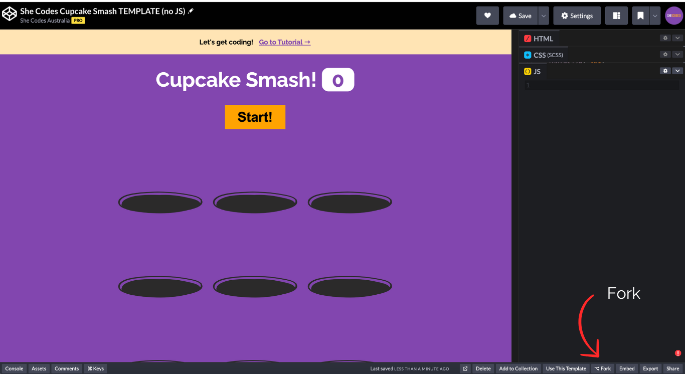

## What We're Doing

We're building a game called Cupcake Smash using a programming language called Javascript.

To build Cupcake Smash, we're using an online tool called CodePen, which is a platform that makes it easy to build and experiment with HTML, CSS and JavaScript, without needing to download or set up any special software.

In case you haven't done our HTML and CSS workshop, HTML defines the content (like buttons and text), CSS styles it (like colours and fonts), and Javascript makes it interactive (like responding to clicks and keeping scores).

You will need a CodePen account to build your own game, head over there now to [create your free account](https://codepen.io).

We've put together a template that already has a lot of the game elements and styles set up - we just need to write the JavaScript to get it working! [Click here to get the template](https://codepen.io/shecodesaus/pen/OPJvGZy).

To create your own copy of the game to work with, click the **Fork** button in the bottom right corner in CodePen (see the screenshot below). This will let you save your own copy of Cupcake Smash so you can come back to it and share it.

Once you have your own fork of the template in CodePen, we can start adding our JavaScript code.

The CodePen screen is split into two sections. On the left (with the coloured background) is where you will be able to see the results of your code in action! This is the actual webpage/game that you will interact with. On the right is where you will write your JavaScript code. We've purposely minimised the HTML & CSS (content and styling) for you so that today you can focus on learning your way around JavaScript.

_This tutorial was made with <3 by [Jo Minney](https://github.com/jomarieminney), [Kate Kiriwn](https://github.com/katekirwin), [Hayley Stewart](https://github.com/hayleycodes), [Amy Kapernick](https://github.com/amykapernick), [Brooke Pierson](https://github.com/Beerooke31), and [Gina Horch](https://github.com/GinaHorch)._