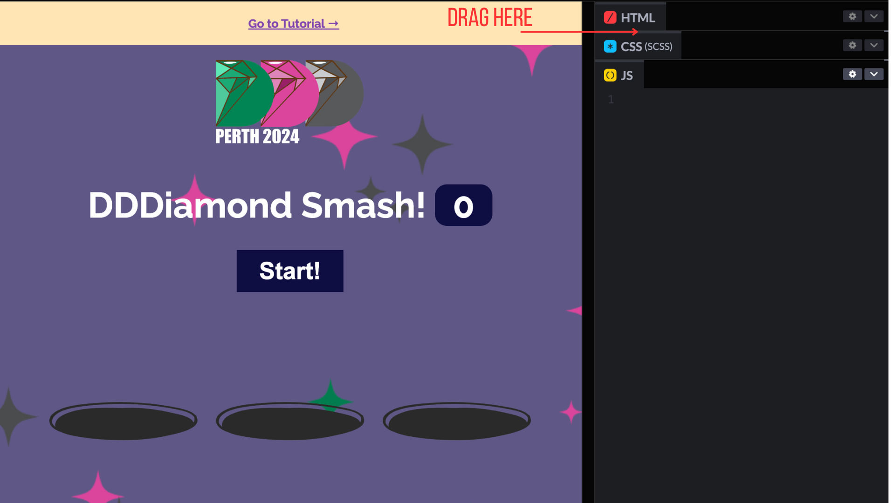
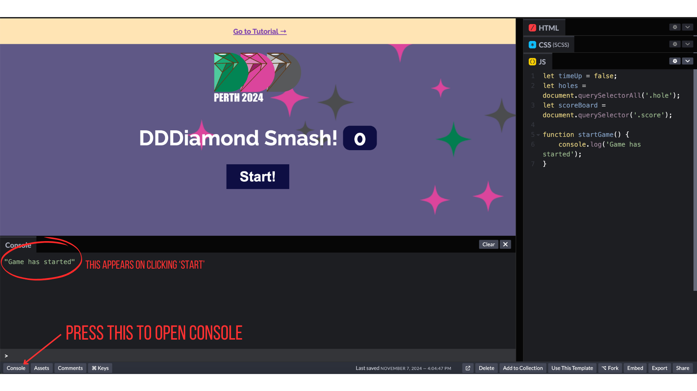

## Creating our Variables

To start off, we're going to grab some of the elements on the page, and save them in a variable so we can access them easily later.

{}

An 'element' as a specific part of the page. For example, the heading text and start button are both elements. Elements are defined using HTML, feel free to unfold the HTML section on CodePen and have a peak! The screenshot below shows where to click and drag to unfold the HTML editor:


{}

> **Variable Alert!**
> A [variable](https://javascript.info/variables#a-variable) is basically a container for storing something that we want to use later. For example, soon we'll create a variable for storing whether or not the user has run out of time in the game.

The first variable that we'll create will be called `timeUp`. We'll use this to stop the game at the end of the allotted time. To do create this variable, simply copy and paste the following code into the JavaScript window in your CodePen!

```js
let timeUp = false;
```

Let's break that down!

---

`let` tells JavaScript that we are about to create a variable. `timeUp` is the name of our variable, and this is how we will reference it throughout the rest of our code.
`false` is what we are storing in the variable.


> Let's introduce the idea of data types! Numbers, Text (otherwise known as "Strings"), and Booleans (True/False values) are all Javascript data types. The timeUp variable is a Boolean, meaning it can only be true or false. We can use it to track if the game is still running, e.g if the value is false the game will stop running.

JavaScript has lots of tricks built into it to make our lives easier, we call these 'functions'. A function is a block of code that performs a task when called (ask the function to run). They help us avoid repeating code and make our programs easier to manage. We will use these functions to create variables based on the content of the page.

In particular we'll be using the `querySelector` and `querySelectorAll` functions. When we created the template code, we added some specific information to different elements on the page. These functions will allow us to use that information to access those elements in our JavaScript.


If you already know some basic HTML & CSS, you'll already be familiar with CSS Selectors such as Classes and ID's, which is what the [`querySelector`](https://developer.mozilla.org/en-US/docs/Web/API/Document/querySelector) and [`querySelectorAll`](https://developer.mozilla.org/en-US/docs/Web/API/Document/querySelectorAll) functions use. If you're new to this, don't stress about it too much - we'll be telling you which selectors to use, and you can find out more about them by taking [our HTML & CSS tutorial](https://tutorials.shecodes.com.au/html_and_css_intro/) when you've got more time! For now, all you need to know is that we are going to using 'hole' and 'score' to define our variables.

<br/>


The following code creates two new variables, called `holes` and `scoreBoard`. Copy and paste this code below the `timeUp` variable that we created earlier:

```js
let holes = document.querySelectorAll('.hole');
let scoreBoard = document.querySelector('.score');
```

## Check your code!

This is what you should have in CodePen so far:

```js
let timeUp = false;
let holes = document.querySelectorAll('.hole');
let scoreBoard = document.querySelector('.score');
```

## Creating our Start & End Functions

Earlier, we mentioned that JavaScript has built in functions, but we can actually write our own too! This is useful because it means we can break our code into different blocks, and run some blocks over and over again, whenever we want!

We're going to create a function called `startGame` and this is going to run everytime the user clicks the **Start** button.

How does this function get triggered?
In our HTML code there is a start button with an `onclick` event:

```HTML
<button onclick="startGame()">Start</button>
```

This means that when the user clicks the start button, JavaScript will run the `startGame()` function.

When we created the HTML code in the template, we actually already instructed the button to run this function when it is clicked. Feel free to peek at the HTML code and see this for yourself! All you need to do is actually create the function, and tell it what to do. For now we're going to ask it to show us a message when the game has started.

Add the following to your JavaScript code in CodePen to create your function:

```js
function startGame() {
    console.log('Game has started');
}
```

Let's test it! In the bottom left corner of your Codepen, click on **Console** to open the console. Try clicking the **Start** button, you should see your message appear!



After a certain about of time has passed, we then want to end the game, so let's write a function for that too:

```js
function endGame() {
    console.log('Game has finished');
}
```

To start the game we press the **Start** button. To then end the game, we will trigger our new `endGame` function from the `startGame` function. We'll use [`setTimeout`](https://developer.mozilla.org/en-US/docs/Web/API/WindowOrWorkerGlobalScope/setTimeout) to do this. This will trigger `endGame` after a delay of 10000ms.

```diff
function startGame() {
    console.log('Game has started');

+    setTimeout(endGame, 10000);
}
```

{}

Note the different colours and `+` indicator in the code example above. This is instructing you to add the `setTimeout` line to your existing `startGame` function, but without the `+` symbol. If you're not sure what to do, the completed code up to this point is provided at the end of this page.

{}

Click the **Start** button again. This time you should see the start message appear, and then a minute later the end message will appear.

{}

If you'd like to learn more about variables or functions (what we just used), you can read more about them here:  
[variables](https://developer.mozilla.org/en-US/docs/Learn/JavaScript/First_steps/Variables)  
[functions](https://developer.mozilla.org/en-US/docs/Learn/JavaScript/Building_blocks/Functions)

{}

## Check your code!

This is what you should have in CodePen so far:

```js
let timeUp = false;
let holes = document.querySelectorAll('.hole');
let scoreBoard = document.querySelector('.score');

function startGame() {
    console.log('Game has started');
    setTimeout(endGame, 10000);
}

function endGame() {
    console.log('Game has finished');
}
```
