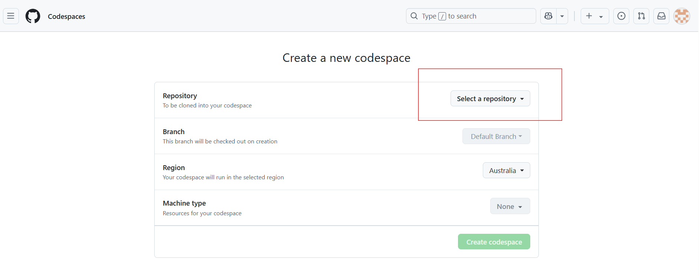
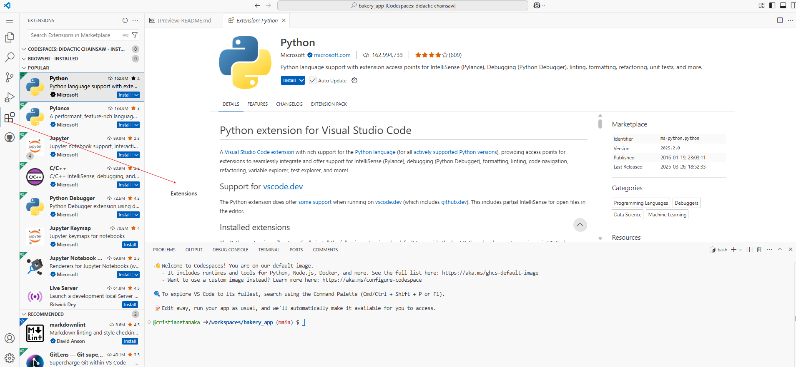
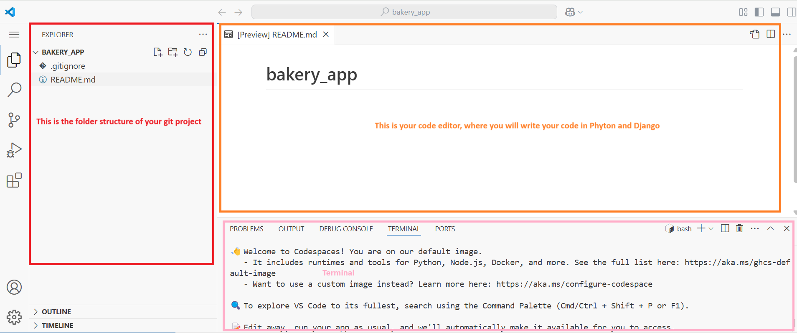
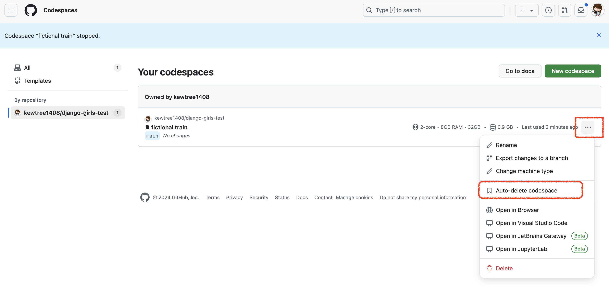

# Installation

In this tutorial you will be building a Bakery app. In order to do that, as you go through the tutorial you'll be instructed on how to install various software on your computer and set up some online accounts as needed if you wish to put your site live on the internet.

---

## MacOS, Windows, Linux Installation

### Brief intro to the command line

Many of the steps below reference the `console`, `terminal`, `command window`, or `command line` -- these all mean the same thing: a window on your computer where you can enter commands. For now, the main thing you need to know is how to open a command window and what it looks like:

#### Opening the command line

- **macOS:** Go to **Launchpad → Other → Terminal**.
- **Linux:** Usually found under **Applications → Accessories → Terminal**.
- **Windows:** 
  - Search **Command Prompt** in the Start menu.
  - Open **Windows System → Command Prompt**.
  - Use `Win + R`, type `cmd`, and press Enter.

#### Install Python

Django is written in Python. We need Python to do anything in Django. Let's start by installing it! We want you to install the latest version of Python 3, so if you have any earlier version, you will need to upgrade it. If you already have version 3.10 or higher you should be fine.

##### **Windows**

1. Download **Python** from [python.org](https://www.python.org/downloads/windows/).
2. Run the installer and ensure you **tick "Add Python 3 to PATH"** before installing.

##### **macOS**
1. Go to [python.org](https://www.python.org/downloads/).
2. Download the latest **Python 3.x** installer.
3. Run the installer and follow the instructions.

##### **Linux**
Check if Python is installed:

```sh
python3 --version
```

If not, install it based on your Linux distribution:

```sh
sudo apt install python3   # Debian/Ubuntu
sudo dnf install python3   # Fedora
sudo zypper install python3  # openSUSE
```

### Install a Code Editor

There are a lot of different editors and it largely boils down to personal preference. Most Python programmers use complex but extremely powerful IDEs (Integrated Development Environments), such as PyCharm. As a beginner, however, that's probably less suitable; our recommendations are equally powerful, but a lot simpler:

- [Visual Studio Code](https://code.visualstudio.com/)

#### Why are we installing a code editor?

You might be wondering why we are installing this special code editor software, rather than using something like Word or Notepad.

The first reason is that code needs to be plain text, and the problem with programs like Word and Textedit is that they don't actually produce plain text, they produce rich text (with fonts and formatting), using custom formats like RTF (Rich Text Format).

The second reason is that code editors are specialized for editing code, so they can provide helpful features like highlighting code with color according to its meaning, or automatically closing quotes for you.

We'll see all this in action later. Soon, you'll come to think of your trusty old code editor as one of your favorite tools. 

### Set up virtual environment and install Django

Before we install Django we will get you to install an extremely useful tool to help keep your coding environment tidy on your computer. It's possible to skip this step, but it's highly recommended to follow it. Starting with the best possible setup will save you a lot of trouble in the future!

So, let's create a virtual environment (also called a virtualenv). Virtualenv will isolate your Python/Django setup on a per-project basis. This means that any changes you make to one website won't affect any others you're also developing. Neat, right?

All you need to do is find a directory in which you want to create the virtualenv; your home directory, for example. On Windows, it might look like `C:\Users\Name\` (where Name is the name of your login).


#### Create a virtual environment

For this tutorial we will be using a new directory bakeryapp from your home directory:

```sh
mkdir bakeryapp
cd bakeryapp
```

We will make a virtualenv called `myvenv`. The general command will be in the format:

**Windows:**

```sh
python -m venv myvenv
```

**Linux/macOS:**

```sh
python3 -m venv myvenv
```

Where myvenv is the name of your virtualenv. You can use any other name, but stick to lowercase and use no spaces, accents or special characters. It is also a good idea to keep the name short – you'll be referencing it a lot!


#### Working with virtualenv

The command above will create a directory called myvenv (or whatever name you chose) that contains our virtual environment (basically a bunch of directories and files).

Start your virtual environment by running:

**Windows:**

```sh
myvenv\Scripts\activate
```

**Linux/macOS:**

```sh
source myvenv/bin/activate
```

#### Install Django

OK, we have all important dependencies in place. We can finally install Django!

Before we do that, we should make sure we have the latest version of pip, the software that we use to install Django:

1. Ensure you have the latest **pip**:

```sh
pip install --upgrade pip
```

2. Create a `requirements.txt` file and add:

```
Django~=5.1.2
```

3. Install dependencies:

```sh
pip install -r requirements.txt
```

---

## Chromebook Installation
To set up your Chromebook, follow the instructions below:

## Using a Cloud IDE Environment (Recommended for Chromebook or Low-Memory Devices)

For users on Chromebooks or laptops with limited memory, we recommend using a **cloud IDE environment**. This allows you to interact with the command line, Python, and Django directly through your browser, with a code editor already installed.

Your installation experience may differ slightly depending on the environment.

---

## Step 1: Create a GitHub Account (if you already don't have one)

1. Go to [GitHub.com](https://github.com) and sign up for a **free** user account.
2. Remember your password — consider saving it in a password manager if you use one.

---

## Step 2: Create a GitHub Project

1. Visit [this link](https://github.com/new) to create a new repository.
2. Use **`bakery_app`** as the project name.
3. Set the repository to **Public** (this is required for deployment; you can make it private later).
4. In Initialize this repository with, make sure to:
   - Add a **README.md** file.
   - Add a **.gitignore** file and select Python.

## Step 3:  Start a Codespace

If you don't want to install any app in your laptop, you can install Codespaces. To install Codespaces

1. Go to GitHub [Codespaces](https://github.com/codespaces/new) and select the repository you just created. Click 'Create Codespace'



wait a little bit and you will see something like that

The [VSCode] (https://code.visualstudio.com/docs/?dv=win64user) editor will open for you automatically.
If you see a notification that says "Install Python", please click on it. If not prompted, click the "Extensions" icon on the left sidebar in the Codespace editor. Search for "Python" and click "Install."



The bash terminal(similar to Linus) is at the bottom page.



By default, the GitHub Codespace environment will be deleted after 1 month (this applies only to the environment, not your code). To prevent auto-deletion, you can adjust the settings on the page: https://github.com/codespaces



## Step 4: Continue with the Tutorial.
Follow the next steps from the section Set up a virtual environment and install Django.
Follow than sections for Ubuntu/Linux. Use the Codespaces command line (terminal), accessible through your browser.
