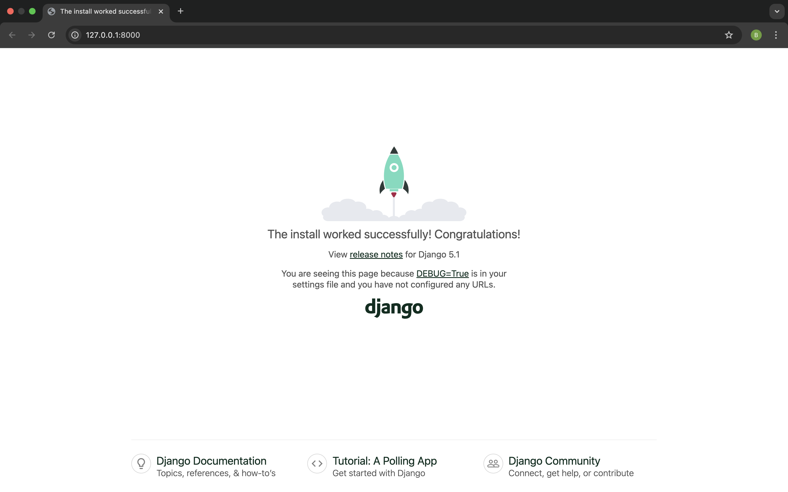

# Your first Django project!

The first step to create our Bakery Finder app is to start a new Django project. Django has some ~magic~ meaning that when we run some scripts, Django will create the skeleton of a Django project for us! The skeleton is a bunch of files that we will explain as we go.

Naming of these files and directories are very important. Django needs to maintain a certain structure to be able to find important bits of information. If they are renamed or moved, it might get confused or throw some unexpected errors. As such, you shouldn't rename the files that we are about to create, or move them around.

Ready to get going?


{}

Remember to run everything in the virtualenv. If you don't see a prefix `(myvenv)` in your console, you need to activate your virtualenv. Feel free to flick back to the installation section for a refresher on what it is. Typing `myvenv\Scripts\activate` on Windows or
`source myvenv/bin/activate` on MacOS or Linux will do this for you.

{}

## Create Project


### MacOS/Linux Users:

In your macOS or Linux console, run the following command. Don’t forget to add the period (or dot) `.` at the end! The period `.` is essential because it tells the script to install Django in your current directory (fun fact: the period `.` is a short-hand reference).

```
(myvenv) bakeryapp% django-admin startproject bakery_project .
```

{}

When typing the command above, remember that you only type the part which starts with django-admin. The `(myvenv) ~/bakeryapp$` part shown here is just example of what your command line will be showing, waiting for your instructions. Yours may look different if your file is called something different or based on the settings on your device. If you're unsure - check in with a mentor!

{}


### Windows Users:

On your Windows terminal, run the following command. Don’t forget to add the period (or dot) `.` at the end! The period `.` is essential because it tells the script to install Django in your current directory (fun fact: the period `.` is a short-hand reference).

```
(myvenv) C:\Users\Name\bakeryapp django-admin.exe startproject bakery_project .
```

{}

When typing the command above, remember that you only type the part which starts by `django-admin.exe`.
The `(myvenv) C:\Users\Name\bakeryapp` part shown here is just example of what your command line will be showing, waiting for your instructions. Yours may look different if your file is called something different or based on the settings on your device. If you're unsure - check in with a mentor!

{}


## Understanding Your Project Structure


`django-admin.py` is a script that will create the directories and files for you. You should now have a directory structure which looks like this:

```
bakeryapp
├── manage.py
├── bakery_project
│   ├── asgi.py
│   ├── __init__.py
│   ├── settings.py
│   ├── urls.py
│   └── wsgi.py
├── myvenv
│   └── ...
└── requirements.txt
```


{}

In your directory structure, you will also see your `myvenv` directory that we created before.

{}

Lets walk through what some of these files are.

The `manage.py` is a script that helps with management of the site. One of the things this file lets us do is to start a web server on our computer without installing anything else.

The `settings.py` file contains the configuration of your website, much like your settings app on your phone or laptop.

Remember when we talked about letters earlier? The `urls.py` file is like an address book, so we can write different letters to different people, with personalised content. There's a little thing called the 'urlresolver' that's going to help us with that down the track.

We can ignore the other files for now as we won't change them - the only thing to remember is not to delete them by accident!

### Let's run it!

Before we get too carried away, lets check your Django project works. You need to be in the directory that contains the `manage.py` file (the `bakery_site` directory). In the console, we can start the web server by running `python manage.py runserver`:

```
(myvenv) bakery_site% python manage.py runserver
```


If you are on Windows and this fails with `UnicodeDecodeError`, use this command instead:

```
(myvenv) bakery_site% python manage.py runserver 0:8000
```


Now you need to check that your website is running. Open your browser ( eg Firefox, Chrome, Safari etc) and enter this address:

```
http://127.0.0.1:8000/
```

You can open this in another browser window and you should see the Django install worked page.

Congratulations! You've just created your first website and run it using a web server! Isn't that awesome?



Note that a command window can only run one thing at a time, and the command window you opened earlier is running the web server. As long as the web server is running and waiting for additional incoming requests, the terminal will accept new text but will not execute new commands.

To type additional commands while the web server is running, open a new terminal window and activate your virtualenv. To stop the web server, switch back to the window in which it's running and press CTRL+C (Control and C keys together). Psst, if that doesn't work on Windows, you might have to press Ctrl+Break.


