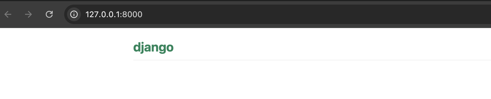

## Let's Build our first Django App

### Creating an application

To keep everything tidy, we will create a separate application inside our project, this will help us to have some nice solid foundations as the project expands. To create an application we need to run the following command in the console (from `bakery_site` directory where `manage.py` file is):

macOS or Linux:
```
(myvenv) bakery_site% python manage.py startapp bakeries
```
Windows:
```
(myvenv) C:\Users\Name\bakery_site> python manage.py startapp bakeries
```

You will notice that a new `bakeries` directory is created and it contains a number of files now. The directories and files in our project should look like this:

```
bakery_site
├── bakeries
│   ├── admin.py
│   ├── apps.py
│   ├── __init__.py
│   ├── migrations
│   │   └── __init__.py
│   ├── models.py
│   ├── tests.py
│   └── views.py
├── db.sqlite3
├── manage.py
├── bakery_project
│   ├── asgi.py
│   ├── __init__.py
│   ├── settings.py
│   ├── urls.py
│   └── wsgi.py
├── myvenv
│   └── ...
└── requirements.txt

```

Congratulations - you have an app now! 


## Django Views

Next, we want to set it up so that when someone visits the homepage (http://127.0.0.1:8000/), Django knows to run a specific function called a *view*. 

The *view* is the brain behind what your user sees on the screen. It recieves the request, adds any extra logic we've added (like filtering, sorting, etc.) and pass it to a `template`. We'll create a *template* a bit later on.

We will add our *views* to the `bakeries/views.py` file.

### bakeries/views.py

OK, let's open up this file in our code editor and see what's in there:

```python
from django.shortcuts import render

# Create your views here.
```

Not too much stuff here yet.

Remember that lines starting with `#` are comments – this means that those lines won't be run by Python.

Let's create a *view* as the comment suggests.

```python
from django.http import HttpResponse

def index(request):
    return HttpResponse("Hello, world. Welcome to our bakery.")


Make sure you hit save on that file and we will go on to URLs.


## What is a URL?

A URL is a web address. You can see a URL every time you visit a website. (`127.0.0.1:8000` is a URL! And `https://shecodes.com.au/` is also a URL.)



Every page on the Internet needs its own URL. Remember that letters analogy way back at the start? The URL is like your address, so the post office knows where to send your mail. Now imagine you live in an apartment building, you might need a way to differentiate your apartment from Bob's next door. In addresses that might be an apartment number or unit number within a building. In a URL it might be something like shecodes.com.au/mentor vs shecodes.com.au/shop - same building but different apartments.

This way your application knows what it should show to a user who opens that URL. In Django, we use something called `URLconf` (URL configuration), which is a set of patterns that Django will try to match the requested URL to find the correct view.

## How do URLs work in Django?

Let’s open up the `bakery_project/urls.py` file in your editor and take a look.

When you create a new Django project, Django automatically creates this file for you:


```python
"""mysite URL Configuration

[...]
"""
from django.contrib import admin
from django.urls import path

urlpatterns = [
    path('admin/', admin.site.urls),
]
```

Time to create our first URL! We want 'http://127.0.0.1:8000/' to be the home page of our app and to display a list of bakeries.

In your `bakery_project/urls.py` file please add the following lines under from django.contrib import admin :

```python

from django.urls import path, include
from bakeries.views import index


urlpatterns = [
    path('admin/', admin.site.urls),
    path('', index),
]
```

The `include()` function lets you include other URL configurations from other apps.

Django will run the `index` view whenever someone goes to the homepage URL (which is just an empty string after the domain name, like `http://127.0.0.1:8000/`).


Alright, save that file. VS Code is super helpful and will have a dot next to your file name if you've got unsaved changes. Its really easy to forget to save, so if you're running code and its not working as expected, double check you've saved the files.


## Hello World

Lets check to see if our website is saying hello to us. As a reminder, you need to be in the directory that contains the `manage.py` file (the `bakery_site` directory). In the console, we can start the web server by running `python manage.py runserver`:

```
(myvenv) bakery_site% python manage.py runserver
```

{}

Since we've run this command before we can actually do a nifty little shortcut. In our terminal, press the up arrow and it should cycle through commands you've previously typed. This will be helpful if you're running the same commands over and over again to just press the up arrow and enter rather than typing it all out. Remember, developers love typing as few keystrokes as possible.

{}

