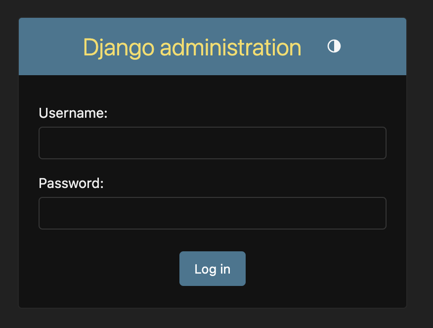
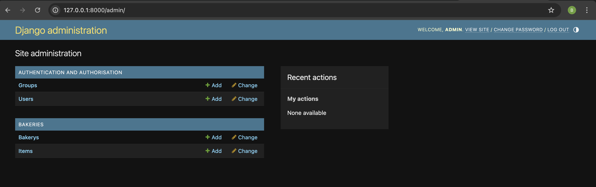
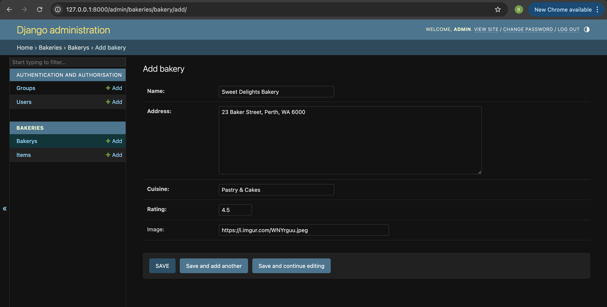

# Django Admin

To add, edit and delete the posts we've just modeled, we will use Django admin.

Let's open the `bakeries/admin.py` file in the code editor and replace its contents with this:


```python
from django.contrib import admin

from .models import Bakery, Item


admin.site.register(Bakery)
admin.site.register(Item)

```

As you can see, we import (include) the Bakery and Item models defined in the previous chapter. To make our models visible on the admin page, we need to register the model with `admin.site.register(Bakery)` and `admin.site.register(Item)`.

OK, time to look at our Bakery and Item models. Remember to run `python manage.py runserver` in the console to run the web server. Go to your browser and type the address http://127.0.0.1:8000/admin/. You will see a login page like this:



To log in, you need to create a *superuser* - a user account that has control over everything on the site. Go back to the command line type `python manage.py createsuperuser`, and press enter.

{}

Remember, to write new commands while the web server is running, open a new terminal window and activate your virtualenv. We reviewed how to write new commands in the <b>Your first Django project!</b> chapter, in the <b>Starting the web server</b> section.

{}

macOS or Linux:
```
(myvenv) bakery_site% python manage.py createsuperuser
```

Windows:
```
(myvenv) ~/bakery_site$ python manage.py createsuperuser
```

When prompted, type your username (lowercase, no spaces), email address, and password. **Don't worry that you can't see the password you're typing in – that's how its supposed to be, for security.** Type it in and press `enter` to continue. The output should look like this (where the username and email should be your own ones):

```
Username: flourpower
Email address: hello@flourpower.com
Password:
Password (again):
Superuser created successfully.
```

Return to your browser. Log in with the superuser's credentials you chose; you should see the Django admin dashboard.



Go to Bakery and experiment a little bit with it. Add two or three bakeries. Don't worry too much about the content – it's only visible to you on your local computer. You can copy some text from the list below if you're looking for inspiration. 

| Bakery Name            | Address                             |
| ---------------------- | ----------------------------------- |
| Flour Power            | 12 Gardenia St, Subiaco WA 6008     |
| Dough Re Mi            | 98 Symphony Rd, Southbank VIC 3006  |
| Rolling in Dough       | 34 Cashmere Ave, New Farm QLD 4005  |
| Batter Late Than Never | 51 Tardy Ln, Glenelg SA 5045        |
| Whisk Takers           | 7 Adventure Ct, Kingston ACT 2604   |
| The Daily Knead        | 101 Baker St, Hobart TAS 7000       |
| Sugar High             | 22 Sherbet Cres, Fremantle WA 6160  |
| Bready or Not          | 9 Puzzle Pde, Brunswick VIC 3056    |
| Muffin But Love        | 66 Crumb Crt, Paddington QLD 4064   |
| Piece of Cake          | 80 Easy St, Northbridge WA 6003     |
| Bake It Happen         | 11 Rise Rd, Newtown NSW 2042        |
| You Batter Believe It  | 42 Sprinkle Way, Norwood SA 5067    |
| Oh, Crumbs!            | 5 Biscuit Blvd, Launceston TAS 7250 |
| Pain in the Bun        | 13 Croissant Pl, Manly NSW 2095     |
| Bon AppéTreat          | 77 Parisian Ln, Carlton VIC 3053    |
| The Baguette About It  | 28 Forget It St, Darwin NT 0800     |



Now head to Item and add some items for each bakery!

| Item Name           | Description                                              |
| ------------------- | -------------------------------------------------------- |
| Sourdough Loaf      | Crusty, tangy artisan bread                              |
| Croissant           | Buttery, flaky French pastry                             |
| Chocolate Éclair    | Choux pastry filled with cream and topped with chocolate |
| Lamington           | Sponge cake coated in chocolate and coconut              |
| Vanilla Slice       | Layers of custard and puff pastry, topped with icing     |
| Apple Turnover      | Pastry filled with stewed apples                         |
| Sausage Roll        | Puff pastry wrapped around seasoned meat                 |
| Cinnamon Scroll     | Swirled bun with cinnamon and icing                      |
| Cupcake             | Individual sponge cake with frosting                     |

If you want to know more about Django admin, check out Django's [documentation](https://docs.djangoproject.com/en/5.1/ref/contrib/admin/)

This is probably a good moment to grab a tea or coffee to re-energize yourself. You created your first Django model – you deserve a little break!
