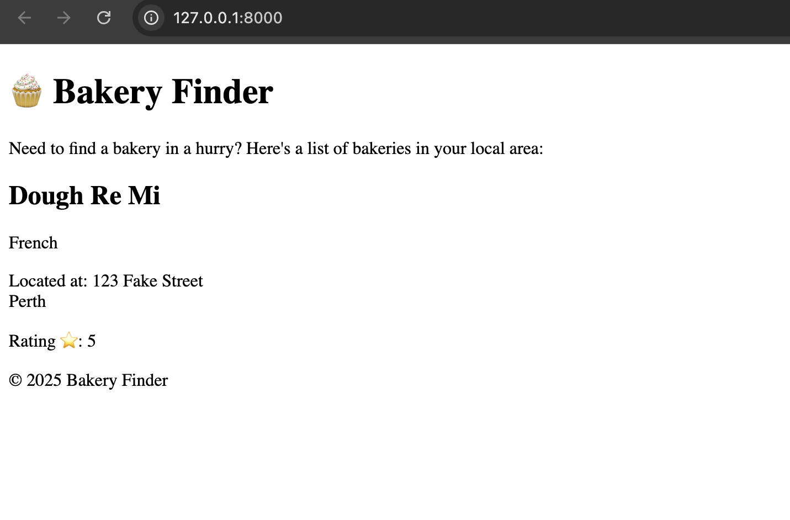
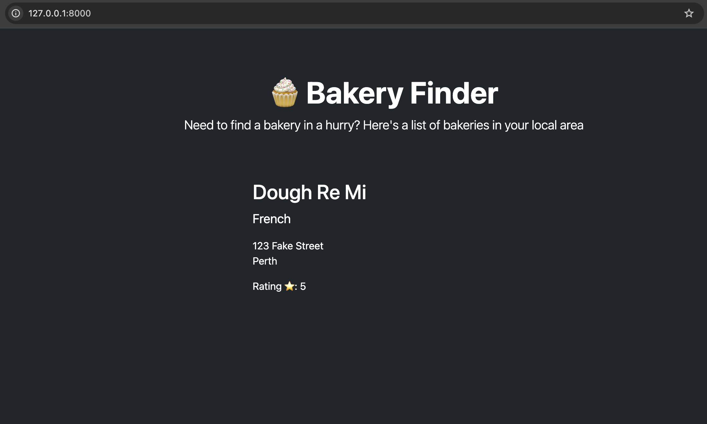

This is so exciting, we've got data from our Django admin but we need to display it on our page. Let's go back to our views.py one more time and update it to look like the below:

```python
from django.shortcuts import render

from .models import Bakery

def index(request):
    context = {
        "bakeries": Bakery.objects.all()
    }
    return render(request, "index.html", context)

```

This is telling our views to go look at our models, pull all the objects we created (remember the objects we talked about in the She's a Model section?) and show us that content, dynamically. Pretty snazzy.


## Adding Django Data – Make It Dynamic!

Right now, the data on your page is hardcoded. But Django is all about **dynamic content** meaning you can pull real data from your database and render it with your template.

So let’s replace our sample bakeries with a smart Django loop that pulls real bakery info from your models. At the **very top** of your template file, add this line:``.
This tells Django to prepare for using static files — like CSS stylesheets, images, or JavaScript. 

Notice in the snippet below we are removing the section in main from `<article>` down to `</article>` and replacing it with code that starts with  and ends with . Watch carefully for the + and - lines in this one - it's easy to get caught out.

```diff

+ 

<!DOCTYPE html>
<html lang="en">
  <head>
    <meta charset="utf-8">
    <title>Bakery Finder</title>
  </head>
  <body>
    <header>
      <h1>🧁 Bakery Finder</h1>
    </header>

    <main>
      <p>Need to find a bakery in a hurry? Here's a list of bakeries in your local area:</p>

-     <article>
-       <h2>Sweet Treats</h2>
-       <p class="description">Specializing in cupcakes and macarons 🍰</p>
-       <p>Located at: 123 Tasty Street</p>
-       <p>Rating ⭐: 4.8</p>
-       <ul>
-         <li>Chocolate Cupcake - $3.50</li>
-         <li>Vanilla Macaron - $2.00</li>
-       </ul>
-     </article>

-     <article>
-       <h2>Bakehouse Delight</h2>
-       <p class="description">Fresh croissants and artisan bread 🥐</p>
-       <p>Located at: 456 Crusty Avenue</p>
-       <p>Rating ⭐: 4.6</p>
-       <ul>
-         <li>Butter Croissant - $4.00</li>
-         <li>Sourdough Loaf - $6.50</li>
-       </ul>
-     </article>

+     
+       <article>
+         <h2>{{ bakery.name }}</h2>
+         <p class="description">{{ bakery.cuisine }}</p>
+         <p>Located at: {{ bakery.address|linebreaksbr }}</p>
+         <p>Rating ⭐: {{ bakery.rating }}</p>
+         <ul>
+           
+             <li>{{ item.name }} - ${{ item.price }}</li>
+           
+         </ul>
+       </article>
+     
+       <p>No bakeries found. Add some via the admin panel!</p>
+     
    </main>

    <footer>
      <p>© 2025 Bakery Finder</p>
    </footer>
  </body>
</html>

```


##  What’s Going On Here?

Let's break down the Django template tags and expressions used in your dynamic page.

- ``  
  → This starts a loop that runs once for **every bakery** in your database. Django will automatically pass the list of bakeries from your view function to this template.

- `{{ bakery.name }}`  
  → This grabs the name of each bakery and displays it in an `<h2>` heading.

- `{{ bakery.cuisine }}`  
  → Maybe they do cupcakes, croissants, sourdough — we’re showing off their specialty.

- `{{ bakery.address|linebreaksbr }}`  
  → The address might have line breaks, and `|linebreaksbr` helps format it nicely with `<br>` tags.

- `{{ bakery.rating }}`  
  → Yep, we’re even showing the star rating!

- ``  
  → This is a **nested loop** that lists each item (like cupcakes, bread, or macarons) that belongs to the current bakery. Django knows the relationship because of your model setup (ForeignKey from `Item` to `Bakery`).

- ``  
  → Super friendly UX: if your database doesn’t have any bakeries yet, Django will show a helpful message.

- ``  
  → This wraps up the loop.

---
Let's go ahead and check your server http://127.0.0.1:8000/




We've got our data in dynamically now, heck yes!! Did you notice though that we added photos for our items in the Django admin but haven't got them on our website yet. We want to be salivating looking at the delicious treats so lets add another snippet to include images.

Inside our code we should have a snippet that starts with `` - let's replace it with the below snippet. See how we now have a line in here with images in it? This should load our photos.

```django
                
                <li><span>{{ item.name }} - ${{ item.price }}</span>
                    <br />
                    </a>
                </li>
                
```

Now, every time you add a new bakery via the admin, it’ll automatically show up here! This is where Django starts feeling like magic ✨

Let's go ahead and check your server http://127.0.0.1:8000/ 





Now let's go to admin http://127.0.0.1:8000/admin. Login with your superuser credentials. Remember in admin section (Chapter 7) where we played around and added some bakery details? It's time to add more and watch it come to life! 

That's all folks, you've built your first Django app. We're so proud of you!!!


