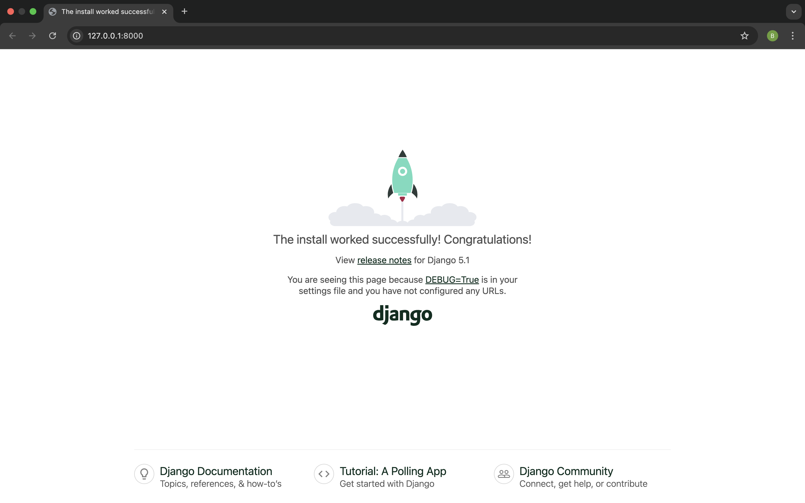

<!--

### How to Use This Template


- **Changing the Project Directory:**  
  Similarly, update `bakery_site` if you decide on a different directory name. This variable is used in command-line examples to help maintain consistency.

- **Updating Placeholder Links:**  
  The placeholders `<<DJANGO_INSTALLATION_LINK>>` and `<<VIRTUALENV_LINK>>` are used in the document where hyperlinks are required.  
  Once you have the actual URLs, **replace them with the correct links**.

- **Updating project name:**  
bakery_project : bakery_project
once final directories and names confirmed, update bakery_project accordingly.

- **update {{link_to_commandline_intro}}**

-->

{}  

Steps of instruction for this chapter is based on tutorials by Django Girls (https://github.com/DjangoGirls/tutorial).

{}


## What will you learn during the tutorial?

By the end of this tutorial, you'll have built a fully functional Django application that showcases a Bakery Finder app for discovering the best local bakeries and their delicious offerings—all at your fingertips.

You’ll learn how to structure your project with Django’s models, views, and templates, and you'll add the finishing touches with custom styling to make your site visually appealing. We’ll even guide you through deploying your app online so that everyone can explore your bakeries and their offerings!

It will (more or less) look like this:

 


# Your first Django project!

The first step is to create our Bakery Finder app is to start a new Django project. Basically, this means that we'll run some scripts provided by Django that will create the skeleton of a Django project for us. This is just a bunch of directories and files that we will use later.

The names of some files and directories are very important for Django. You should not rename the files that we are about to create. Moving them to a different place is also not a good idea. Django needs to maintain a certain structure to be able to find important things.


{}

Remember to run everything in the virtualenv. If you don't see a prefix `(myvenv)` in your console, you need to activate your virtualenv. We explained how to do that in the [Django installation](<<DJANGO_INSTALLATION_LINK>>) chapter in the [Working with virtualenv](<<VIRTUALENV_LINK>>) part. Typing `myvenv\Scripts\activate` on Windows or
`source myvenv/bin/activate` on macOS or Linux will do this for you.

{}

## Create Project


### Mac/Linux Users:

In your macOS or Linux console, you should run the following command. **Don't forget to add the period (or dot) `.` at the end!**

```
(myvenv) bakery_site% django-admin startproject bakery_project .
```


{}

The period `.` is crucial because it tells the script to install Django in your current directory (for which the period `.` is a short-hand reference).

{}


{}

**Note** When typing the command above, remember that you only type the part which starts by `django-admin`.
The `(myvenv) ~/bakery_site$` part shown here is just example of the prompt that will be inviting your input on your command line.

{}


### Windows Users:

On Windows you should run the following command. **(Don't forget to add the period (or dot) `.` at the end)**:

```
(myvenv) ~/bakery_site$ django-admin.exe startproject bakery_project .
```

{}


The period `.` is crucial because it tells the script to install Django in your current directory (for which the period `.` is a short-hand reference).

{}


{}

**Note** When typing the command above, remember that you only type the part which starts by `django-admin.exe`.
The `(myvenv) C:\Users\Name\bakery_site>` part shown here is just example of the prompt that will be inviting your input on your command line.

{}


## Understanding Your Project Structure


`django-admin.py` is a script that will create the directories and files for you. You should now have a directory structure which looks like this:

```
bakery_site
├── manage.py
├── bakery_project
│   ├── asgi.py
│   ├── __init__.py
│   ├── settings.py
│   ├── urls.py
│   └── wsgi.py
├── myvenv
│   └── ...
└── requirements.txt
```


{}

 **Note**: in your directory structure, you will also see your `myvenv` directory that we created before.

{}

The `manage.py` is a script that helps with management of the site. With it we will be able (among other things) to start a web server on our computer without installing anything else.

The `settings.py` file contains the configuration of your website.

Remember when we talked about a mail carrier checking where to deliver a letter? `urls.py` file contains a list of patterns used by `urlresolver`.

Let's ignore the other files for now as we won't change them. The only thing to remember is not to delete them by accident!


<!--  
In the `bakery_app` so far( 24/02/25), the `settings.py` file remains unchanged from the default, except for the part where we need to add our app to the `INSTALLED_APPS` list—which is not required at this stage! 

The Django Girls tutorial provides explanations about different parts of `settings.py` that can be modified. This is helpful for giving users a broader understanding of what the settings file includes.  

If we need a shorter version of tutorial some parts of this section are unnecessary 
-->


## Changing settings

Let's make some changes in `bakery_project/settings.py`. Open the file using the code editor you installed earlier.

<!-- my personal opinion: this note on how to open the file is unnecessary as we expect the user be already on vscode, PLEASE FEEL FREE TO SKIP THIS **Note** if required-->

{}

**Note**: Keep in mind that `settings.py` is a regular file, like any other. You can open it from inside the code editor, using the "File -> Open" menu action. This should get you the usual window in which you can navigate to your `settings.py` file and select it. Alternatively, you can open the file by navigating to the `bakery_site/bakery_project` folder on your desktop and right-clicking on it. Then, select your code editor from the list. Selecting the editor is important as you might have other programs installed that can open the file but will not let you edit it.

{}


### Time Zone and Location

It would be nice to have the correct time on our website. Go to [Wikipedia's list of time zones](https://en.wikipedia.org/wiki/List_of_tz_database_time_zones) and copy your relevant time zone (TZ) (e.g. `Australia/Perth`).

In `settings.py`, find the line that contains `TIME_ZONE` and modify it to choose your own timezone.  For example:

```python
-TIME_ZONE = "UTC"
+TIME_ZONE = 'Australia/Perth'
```

A language code consist of the language, e.g. `en` for English or `de` for German, and the country code, e.g. `de` for Germany or `AU` for Australia. If English is not your native language, you can add this to change the default buttons and notifications from Django to be in your language. So you would have "Cancel" button translated into the language you defined here. [Django comes with a lot of prepared translations](https://docs.djangoproject.com/en/5.1/ref/settings/#language-code).

If you want a different language, change the language code by changing the following line:

```python
-LANGUAGE_CODE = "en-us"
+LANGUAGE_CODE = 'en-AU'
```

<!-- SHOULD WE KEEP LANGUAGE CODE THE DEFAULT: en-us ? -->

### Templates Directory

By default, Django already knows how to find templates stored inside each app folder. But as your project grows, it’s helpful to have a shared location where you keep your main templates.

Let’s tell Django to look inside a `templates` folder located at `bakery_project/templates/`.

Open `settings.py`, and find the `TEMPLATES` section. Update the `'DIRS'` entry like this:

```

TEMPLATES = [
    {
        'BACKEND': 'django.template.backends.django.DjangoTemplates',
-        'DIRS': [],
+        'DIRS': [BASE_DIR / "bakery_project" / "templates"],

        'APP_DIRS': True,
        'OPTIONS': {
            'context_processors': [
                'django.template.context_processors.debug',
                'django.template.context_processors.request',
                'django.contrib.auth.context_processors.auth',
                'django.contrib.messages.context_processors.messages',
            ],
        },
    },
]

```


This tells Django to also search in this folder when rendering HTML pages.

You don’t need to create the folder just yet — we’ll walk you through that later when we build your first template.

{} Using a shared templates directory keeps things tidy, especially when building base layouts used across multiple apps. {}

### Static and Media Files

We'll also need to add a path for static files. (We'll find out all about static files and CSS later in the tutorial.) Go down to the *end* of the file, and just underneath the `STATIC_URL` entry, add a new one called `STATIC_ROOT`:

```
+STATICFILES_DIRS = [
+    BASE_DIR / "bakery_project" / "static",
+]

STATIC_URL = "static/"
+STATIC_ROOT = BASE_DIR / "bakery_project" / "staticfiles"

+MEDIA_URL = "media/"
+MEDIA_ROOT = BASE_DIR / "bakery_project" / "media"

```

#### Let’s break this down:

- **`STATICFILES_DIRS`**: Tells Django where to find your custom static files during development.  
  In this case, we’re keeping them inside `bakery_project/static/`.

- **`STATIC_URL`**: This is the URL prefix for accessing static files in your browser  
  (e.g., `http://localhost:8000/static/`).

- **`STATIC_ROOT`**: When you deploy your project, Django will collect all static files into this folder.  
  Think of this like a "ready-to-serve" folder for production.

- **`MEDIA_URL`**: This is the URL prefix for accessing media files  
  (e.g., `http://localhost:8000/media/`).

- **`MEDIA_ROOT`**: This tells Django where uploaded media files should be stored on your computer or server.

You don’t need to create these folders just yet — Django will take care of it when we use the `collectstatic` command or when users upload media.

{}  
**Tip**: You might not use media files right away, but it’s good practice to include the setup early.  
That way you’re ready when you add profile images or product photos later!  
{}


### Allowed Hosts 

When `DEBUG` is `True` and `ALLOWED_HOSTS` is empty, the host is validated against `['localhost', '127.0.0.1', '[::1]']`. This won't
match our hostname on PythonAnywhere once we deploy our application so we will change the following setting:

```python
-ALLOWED_HOSTS = []
+ALLOWED_HOSTS = ['localhost', '127.0.0.1', '.pythonanywhere.com']

```

{}

**Note**: If you're using a Chromebook, add this line at the bottom of your settings.py file:
`MESSAGE_STORAGE = 'django.contrib.messages.storage.session.SessionStorage'`

{}


<!-- skip or keep below?? -->
{}

Also add `.amazonaws.com` to the `ALLOWED_HOSTS` if you are using cloud9

{}


> If you are hosting your project on `Glitch.com`, let us protect the Django secret key that needs to
> remain confidential (otherwise, anyone remixing your project could see it):
>
>   * First, we are going to create a random secret key.
>     Open the Glitch terminal again, and type the following command:
>
>     ```bash
>     python -c 'from django.core.management.utils import get_random_secret_key; \
>           print(get_random_secret_key())'
>     ```
>     This should display a long random string, perfect to use as a secret key for your brand new Django web site.
>     We will now paste this key into a `.env` file that Glitch will only show you if you are the owner of the web site.
>
>   * Create a file `.env` at the root of your project and add the following property in it:
>
>     ```bash
>     # Here, inside the single quotes, you can cut and paste the random key generated above
>     SECRET='3!0k#7ds5mp^-x$lqs2%le6v97h#@xopab&oj5y7d=hxe511jl'
>     ```


>   * Then update the Django settings file to inject this secret value and set the Django web site name:
>
>     ```python
>     import os
>
>     SECRET_KEY = os.getenv('SECRET')
>     ```
>   * And a little further down in the same file, we inject the name of your new Glitch website:
>
>     ```python
>     ALLOWED_HOSTS = [os.getenv('PROJECT_DOMAIN') + ".glitch.me"]
>     ```
>     The `PROJECT_DOMAIN` value is automatically generated by Glitch.
>     It will correspond to the name of your project.

<!-- skip or keep above?? -->


## Set up a database

There's a lot of different database software that can store data for your site. We'll use the default one, `sqlite3`.

This is already set up in this part of your `mysite/settings.py` file:

```python
DATABASES = {
    "default": {
        "ENGINE": "django.db.backends.sqlite3",
        "NAME": BASE_DIR / "db.sqlite3",
    }
}
```

To create a database for our blog, let's run the following in the console: `python manage.py migrate` (we need to be in the `bakery_site` directory that contains the `manage.py` file). If that goes well, you should see something like this:

```

(myvenv)  bakery_site% python manage.py migrate
Operations to perform:
  Apply all migrations: admin, auth, contenttypes, sessions
Running migrations:
  Applying contenttypes.0001_initial... OK
  Applying auth.0001_initial... OK
  Applying admin.0001_initial... OK
  Applying admin.0002_logentry_remove_auto_add... OK
  Applying admin.0003_logentry_add_action_flag_choices... OK
  Applying contenttypes.0002_remove_content_type_name... OK
  Applying auth.0002_alter_permission_name_max_length... OK
  Applying auth.0003_alter_user_email_max_length... OK
  Applying auth.0004_alter_user_username_opts... OK
  Applying auth.0005_alter_user_last_login_null... OK
  Applying auth.0006_require_contenttypes_0002... OK
  Applying auth.0007_alter_validators_add_error_messages... OK
  Applying auth.0008_alter_user_username_max_length... OK
  Applying auth.0009_alter_user_last_name_max_length... OK
  Applying auth.0010_alter_group_name_max_length... OK
  Applying auth.0011_update_proxy_permissions... OK
  Applying auth.0012_alter_user_first_name_max_length... OK
  Applying sessions.0001_initial... OK
```

And we're done! Time to start the web server and see if our website is working!

## Starting the web server

You need to be in the directory that contains the `manage.py` file (the `bakery_site` directory). In the console, we can start the web server by running `python manage.py runserver`:

```
(myvenv) bakery_site% python manage.py runserver
```

If you are on a Chromebook, use this command instead:

```
(myvenv) bakery_site% python manage.py runserver 0.0.0.0:8080
```

<!-- should i keep glitch parts? 

or this one if you are using Glitch:

Glitch.com terminal
```
$ refresh

```
-->

If you are on Windows and this fails with `UnicodeDecodeError`, use this command instead:

```
(myvenv) bakery_site% python manage.py runserver 0:8000
```


Now you need to check that your website is running. Open your browser (Firefox, Chrome, Safari, Internet Explorer or whatever you use) and enter this address:

```
http://127.0.0.1:8000/
```

<!-- 
If you're using a Chromebook and Cloud9, instead click the URL in the pop-up window that should have appeared in the upper right corner of the command window where the web server is running. The URL will look something like:

```
https://<a bunch of letters and numbers>.vfs.cloud9.us-west-2.amazonaws.com
```
or on Glitch:
```
https://name-of-your-glitch-project.glitch.me
```

-->


You can open this in another browser window and you should see the Django install worked page.

Congratulations! You've just created your first website and run it using a web server! Isn't that awesome?



Note that a command window can only run one thing at a time, and the command window you opened earlier is running the web server. As long as the web server is running and waiting for additional incoming requests, the terminal will accept new text but will not execute new commands.

> We reviewed how web servers work in the <b>How the Internet works</b> chapter.

To type additional commands while the web server is running, open a new terminal window and activate your virtualenv -- to review instructions on how to open a second terminal window, see [Introduction to the command line]({{link_to_commandline_intro}}). To stop the web server, switch back to the window in which it's running and press CTRL+C - Control and C keys together (on Windows, you might have to press Ctrl+Break).


Ready for the next step? It's time to create some content!

