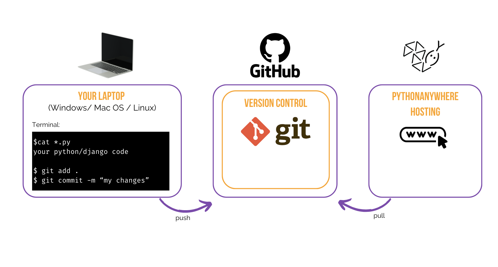
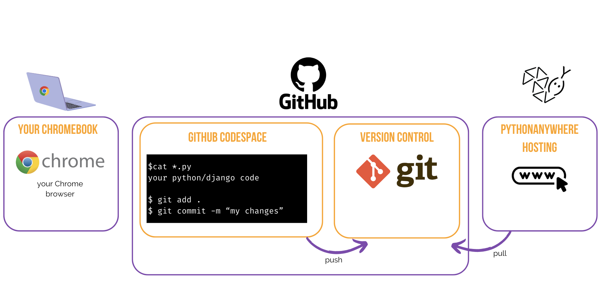
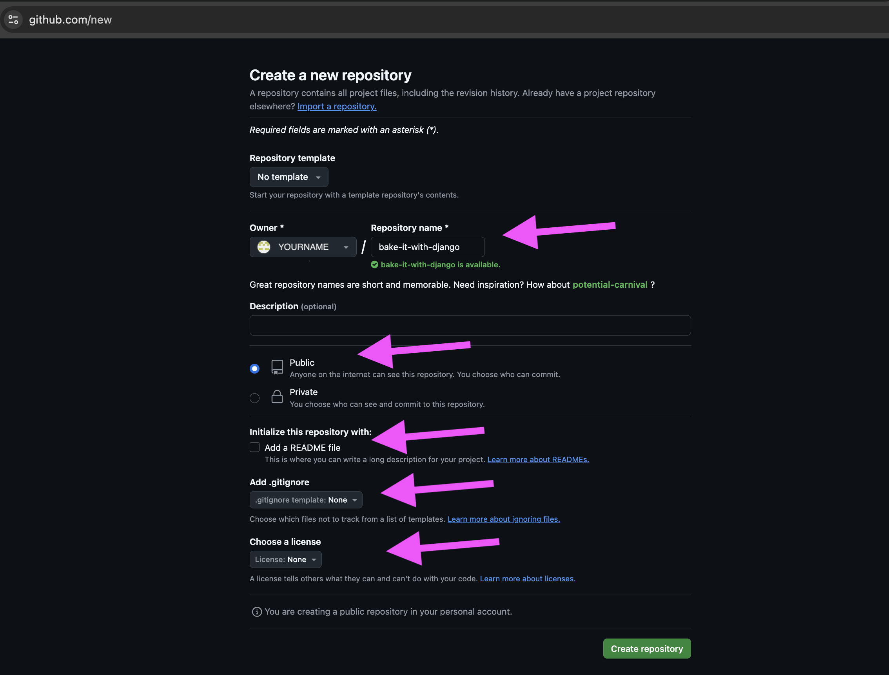
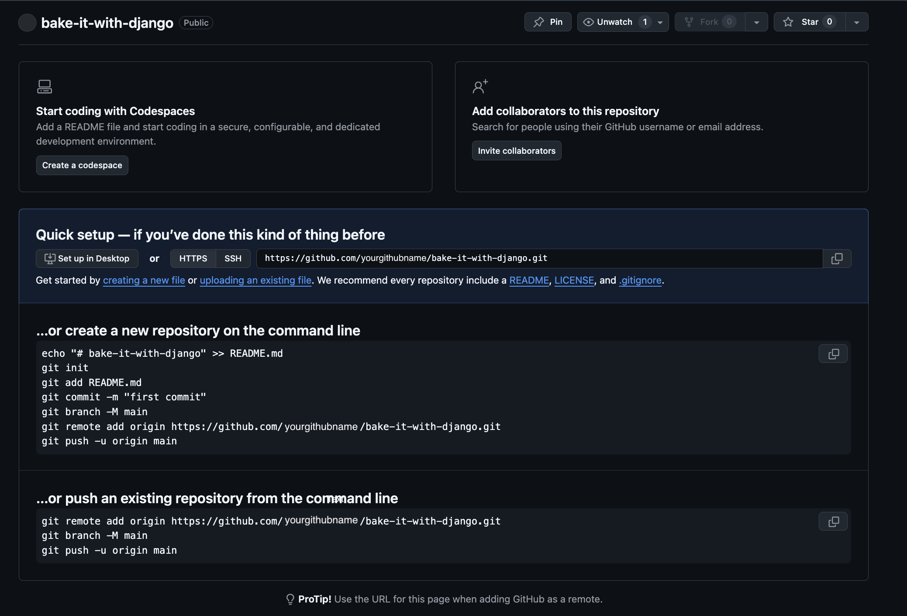
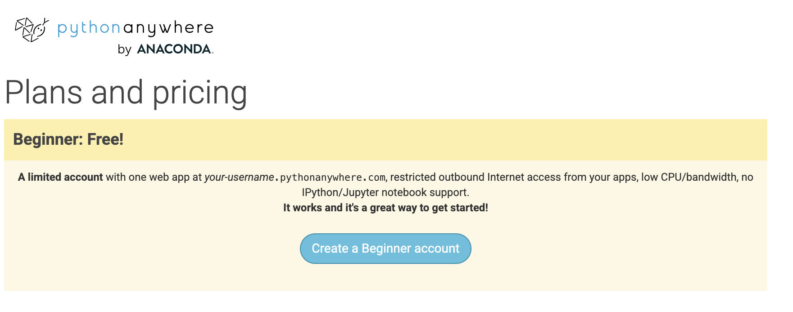
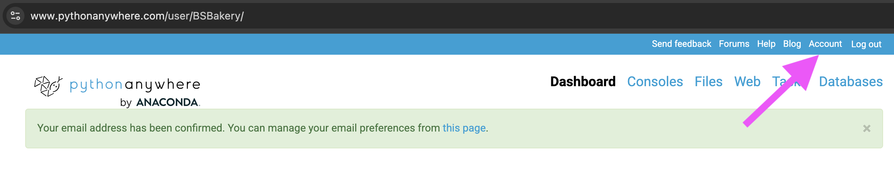
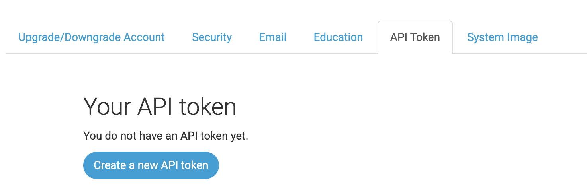
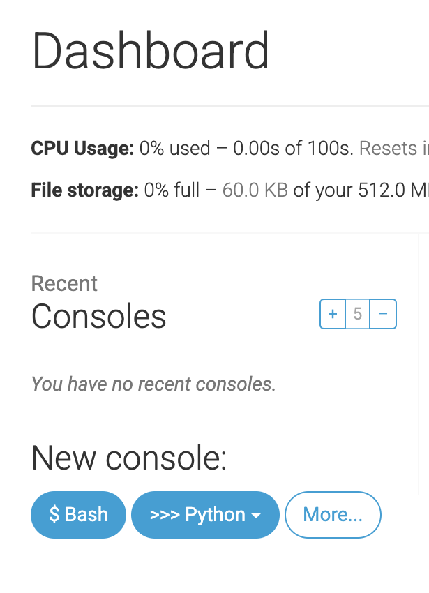
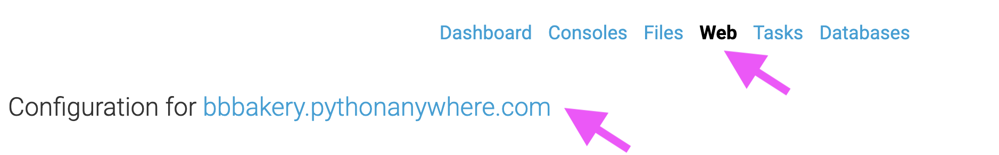

# Deploy!

> **Note** The following chapter can be sometimes a bit hard to get through. Persist and finish it; deployment is an important part of the website development process. This chapter is placed in the middle of the tutorial so that your mentor can help with the slightly trickier process of getting your website online. This means you can still finish the tutorial on your own if you run out of time.

Until now, your website was only available on your computer.  Now you will learn how to deploy it! Deploying is the process of publishing your application on the Internet so people can finally go and see your app. :)

As you learned, a website has to be located on a server. There are a lot of server providers available on the internet, we're going to use [PythonAnywhere](https://www.pythonanywhere.com/). PythonAnywhere is free for small applications that don't have too many visitors so it'll definitely be enough for you now.

The other external service we'll be using is [GitHub](https://www.github.com), which is a code hosting service. There are others out there, but almost all programmers have a GitHub account these days, and now so will you!

These three places will be important to you. Your local computer will be the place where you do development and testing. When you're happy with the changes, you will place a copy of your program on GitHub. Your website will be on PythonAnywhere and you will update it by getting a new copy of your code from GitHub.

The deployment process can be illustrated as follows:



If you’re using a **Chromebook** and [GitHub Codespaces](https://github.com/codespaces), your setup will look a bit different. All code-related changes are made not locally on your **Chromebook**, but in the Cloud Environment provided by GitHub.

The deployment process on **Chromebook** and Cloud environment can be illustrated as follows:



# Git

> **Note** If you already did the [installation steps](../installation/README.md), there's no need to do this again – you can skip to the next section and start creating your Git repository.



> **Note** If you're using a **Chromebook** and have already completed the **Chromebook** Installation [part](../chromebook_setup/README.md), you've already created the repository and can **skip** all commands from the "Starting our Git repository" and "Ignoring files" chapters. You can continue from the "First Git commands" chapter.  While you’re welcome to read these chapters, the Terminal commands can be skipped. 

## Starting our Git repository

Git tracks changes to a particular set of files in what's called a code repository (or "repo" for short). Let's start one for our project. Open up your console and run these commands, in the `bakery_site` directory:

> **Note** Check your current working directory with a `pwd` (macOS/Linux) or `cd` (Windows) command before initializing the repository. You should be in the `bakery_site` folder.

command-line
```
$ git init
Initialized empty Git repository in ~/bakery_site/.git/
$ git config --global user.name "Your Name"
$ git config --global user.email you@example.com
```
Initializing the git repository is something we need to do only once per project (and you won't have to re-enter the username and email ever again).

### Ignoring files

Git will track changes to all the files and folders in this directory, but there are some files we want it to ignore. We do this by creating a file called `.gitignore` in the base directory which is bakery_site. Open up your editor and create a new file with the following contents:

.gitignore
```
# Python
*.pyc
*~
__pycache__

# Env
.env
myvenv/
venv/

# Database
db.sqlite3

# Static folder at project root
/static/

# macOS
._*
.DS_Store
.fseventsd
.Spotlight-V100

# Windows
Thumbs.db*
ehthumbs*.db
[Dd]esktop.ini
$RECYCLE.BIN/

# Visual Studio
.vscode/
.history/
*.code-workspace
```

And save it as `.gitignore` in the "bakery_site" folder.

> **Note** The dot at the beginning of the file name is important!  If you're having any difficulty creating it (Macs don't like you to create files that begin with a dot via the Finder, for example), then use the "Save As" feature in your editor; it's bulletproof. And be sure not to add `.txt`, `.py`, or any other extension to the file name -- it will only be recognized by Git if the name is just `.gitignore`.
Linux and MacOS treat files with a name that starts with `.` (such as `.gitignore`) as hidden
and the normal `ls` command won't show these files.
Instead use `ls -a` to see the `.gitignore` file.

> **Note** One of the files you specified in your `.gitignore` file is `db.sqlite3`. That file is your local database, where all of your users and posts are stored. We'll follow standard web programming practice, meaning that we'll use separate databases for your local testing site and your live website on PythonAnywhere. The PythonAnywhere database could be SQLite, like your development machine, but usually you will use one called MySQL which can deal with a lot more site visitors than SQLite. Either way, by ignoring your SQLite database for the GitHub copy, it means that all of the posts and superuser you created so far are going to only be available locally, and you'll have to create new ones on production. You should think of your local database as a good playground where you can test different things and not be afraid that you're going to delete your real bakery from your bakery app.


### First Git commands

It's a good idea to use a `git status` command before `git add` or whenever you find yourself unsure of what has changed. This will help prevent any surprises from happening, such as wrong files being added or committed. The `git status` command returns information about any untracked/modified/staged files, the branch status, and much more. The output should be similar to the following:

command-line
```
git status
On branch main

No commits yet

Untracked files:
  (use "git add <file>..." to include in what will be committed)
        .gitignore
        bakeries/
        bakery_project/
        manage.py
        requirements.txt

nothing added to commit but untracked files present (use "git add" to track)

```

And finally we save our changes. Go to your console and run these commands:

command-line
```
$ git add .
$ git commit -m "My Bakery app, first commit"
[main (root-commit) c79da8a] My Bakery app, first commit
 16 files changed, 318 insertions(+)
 create mode 100644 .gitignore
 create mode 100644 bakeries/models.py
 create mode 100644 bakery_project/settings.py
 create mode 100755 manage.py
[...]

```


## Pushing your code to GitHub

Go to [GitHub.com](https://www.github.com) and sign up for a new, free user account. (If you already did that in the workshop prep, that is great!) Be sure to remember your password (add it to your password manager, if you use one).

Then, create a new repository, giving it the name "my-first-django-app". Leave the "initialize with a README" checkbox unchecked, leave the .gitignore option blank (we've done that manually) and leave the License as None.



> **Note** The name `bake-it-with-django` is important – you could choose something else, but it's going to occur lots of times in the instructions below, and you'd have to substitute it each time. It's probably easier to stick with the name `bake-it-with-django`.

On the next screen, you'll be shown your repo's clone URL, which you will use in some of the commands that follow:



Now we need to hook up the Git repository on your computer to the one up on GitHub.

Type the following into your console (replace `<your-github-username>` with the username you entered when you created your GitHub account, but without the angle-brackets -- the URL should match the clone URL you just saw).

command-line
```
$ git remote add origin https://github.com/<your-github-username>/bake-it-with-django.git
$ git branch -M main
$ git push origin main

```

When you push to GitHub, you'll be asked for your GitHub username and password (either right there in the command-line window or in a pop-up window), and after entering credentials you should see something like this:

command-line
```
Enumerating objects: 19, done.
Counting objects: 100% (19/19), done.
Delta compression using up to 12 threads
Compressing objects: 100% (17/17), done.
Writing objects: 100% (19/19), 4.54 KiB | 2.27 MiB/s, done.
Total 19 (delta 1), reused 0 (delta 0), pack-reused 0
remote: Resolving deltas: 100% (1/1), done.
To https://github.com/yourgithubname/bake-it-with-django.git
 * [new branch]      main -> main

```

**Note** You will likely encounter the following error when trying to push to GitHub:
```
remote: Support for password authentication was removed on August 13, 2021.
remote: Please see https://docs.github.com/get-started/getting-started-with-git/about-remote-repositories#cloning-with-https-urls for information on currently recommended modes of authentication.
fatal: Authentication failed for 'https://github.com/<your-github-username>/bake-it-with-django.git/'
```
In this case, follow the instructions from GitHub to [create a personal access token](https://docs.github.com/en/authentication/keeping-your-account-and-data-secure/managing-your-personal-access-tokens#creating-a-personal-access-token-classic). The token should have the 'repo' scope. Copy the value of the token, then try the git push command again. When you are prompted to enter your username and password, enter the access token instead of your password:

1. Go to profile settings or go here: https://github.com/settings/profile
2. Scroll down and click "Developer settings" on left-hand menu or go here: https://github.com/settings/apps
3. On left-hand menu, press "Personal access tokens" to expand the dropdown menu. Click "Tokens (classic)"
4. In the top-right, click "Generate new token", and then click "Generate new token (classic)". You will need to authenticate your account at this point.
5. Fill in the form:
  - Note: BAKE it with Django 
  - Expiration: No expiration (or if you want more security, choose 90 days)
  - Select scopes: Check every box 
6. Press "Generate token"
7. Copy the token generated (it's the text string that likely starts with `ghp...`) and store this token somewhere secure as once you close this page, you will lose access to viewing this token and will need to generate a new one if you lose it. For example, you could store it in a password manager or even in a note on your computer.
8. Run the command in the terminal again:
  command-line
  ```
  $ git push -u origin main
  ```
9. When the terminal asks for `username`, enter in your github username. Press enter.
10. Next, it will ask for `password`. Do not use your github password as this method of authenticating ("logging in") is deprecated. Copy the token you just generated (either from github or wherever you carefully stored this token) and carefully paste it into the terminal. Note that as you paste or even type into the terminal for the password, nothing will appear (you can't see what you typed) for security reasons (it's designed like this on purpose). Press enter.
11. If that worked, you will see the output as below. If you are unsuccesful, try to run `git push -u origin main` again and make sure that you enter in your github username and the token (as the password) correctly.

command-line
```
Enumerating objects: 19, done.
Counting objects: 100% (19/19), done.
Delta compression using up to 12 threads
Compressing objects: 100% (17/17), done.
Writing objects: 100% (19/19), 4.54 KiB | 2.27 MiB/s, done.
Total 19 (delta 1), reused 0 (delta 0), pack-reused 0
remote: Resolving deltas: 100% (1/1), done.
To https://github.com/yourgithubname/bake-it-with-django.git
 * [new branch]      main -> main
```

<!--TODO: maybe do ssh keys installs in install party, and point ppl who dont have it to an extension -->

Your code is now on GitHub. Go and check it out!  You'll find it's in fine company – [Django](https://github.com/django/django), the She Codes Tutorial, and many other great open source software projects also host their code on GitHub. :)


# Setting up our website on PythonAnywhere

## Sign up for a PythonAnywhere account

> **Note** You might have already created a PythonAnywhere account earlier during the install steps – if so, no need to do it again.

PythonAnywhere is a service for running Python code on servers "in the cloud". We'll use
it for hosting our site, live and on the Internet.

We will be hosting the bakery app we're building on PythonAnywhere. Sign up for a "Beginner" account on PythonAnywhere (the free tier is fine, you don't need a credit card).

* [www.pythonanywhere.com](https://www.pythonanywhere.com/)



> **Note** When choosing your username here, bear in mind that your bakery app's URL will take the form `yourusername.pythonanywhere.com`, so choose either your own nickname or consider using a relevant name like bakery. Also, be sure to remember your password (add it to your password manager, if you use one).


## Creating a PythonAnywhere API token

This is something you only need to do once.  When you've signed up for PythonAnywhere, you'll be taken to your dashboard.  Find the link near the top right to your "Account" page:



then select the tab named "API token", and hit the button that says "Create new API token".




## Configuring our site on PythonAnywhere

Go back to the main [PythonAnywhere Dashboard](https://www.pythonanywhere.com/) by clicking on the logo, and choose the option to start a "Bash" console – that's the PythonAnywhere version of a command line, just like the one on your computer.



> **Note** PythonAnywhere is based on Linux, so if you're on Windows, the console will look a little different from the one on your computer.

Deploying your Django app on PythonAnywhere involves:
- Pulling your code from GitHub
- Creating a virtual environment
- Running migrations
- And configuring the server to serve your web application

There are manual ways to do this, but PythonAnywhere provides a handy **autoconfigure script** to automate most of it.


Let's install it first:

```
$ pip3.10 install --user pythonanywhere

```

> **Note:**  
>If you're unsure what Python versions are available, run:
>```bash
>ls /usr/bin/python*
>```
>For most users, `3.10` is a safe choice.


When you run the command, you should see output like this:

```
Collecting pythonanywhere  
...  
Successfully installed pythonanywhere-0.15.5 pythonanywhere_core-0.2.4 rich-13.9.4 schema-0.7.7 shellingham-1.5.4 snakesay-0.10.3 tabulate-0.9.0 typer-0.15.2
```
It’s totally fine if your version numbers are slightly different — the important part is that the installation completes successfully.


Now we’ll use the `pa_autoconfigure_django.py` helper to deploy your project from GitHub. Replace the URL below with your actual GitHub repo:


PythonAnywhere command-line
```
$ pa_autoconfigure_django.py --python=3.10 https://github.com/<your-github-username>/<your-repo-name>.git

```

As you watch that running, you'll be able to see what it's doing:

- Clone your repo from GitHub
- Set up a virtual environment
- Update Django settings for deployment
- Run `python manage.py migrate` to set up your database
- Collect static files
- Configure PythonAnywhere to serve your site via its API

On PythonAnywhere all those steps are automated, but they're the same steps you would have to go through with any other server provider.

```

Reloading bbbakery.pythonanywhere.com via API >
   \
    ~<:>>>>>>>>>
  ___________________________________
/                                     \
| All done!  Your site is now live at |
| https://bbbakery.pythonanywhere.com |
\                                     /
  -----------------------------------
   \
    ~<:>>>>>>>>>
    
```


The main thing to notice right now is that your database on PythonAnywhere is actually totally separate from your database on your own computer, so it can have different posts and admin accounts. As a result, just as we did on your own computer, we need to initialize the admin account with `createsuperuser`. PythonAnywhere has automatically activated your virtualenv for you, so all you need to do is run:

PythonAnywhere command-line
```
(bbBakery.pythonanywhere.com) $ python manage.py createsuperuser
```

Type in the details for your admin user.  Best to use the same ones as you're using on your own computer to avoid any confusion, unless you want to make the password on PythonAnywhere more secure.

Now, if you like, you can also take a look at your code on PythonAnywhere using `ls`:

PythonAnywhere command-line
```
(bbBakery.pythonanywhere.com) $ ls
bakeries  bakery_project  db.sqlite3  manage.py  requirements.txt  static
(bbBakery.pythonanywhere.com) (main)$ ls bakeries
__init__.py  __pycache__  admin.py  apps.py  migrations  models.py  tests.py  views.py

```


## You are now live!

Your site should now be live on the public Internet!  Click on the logo, go through to the PythonAnywhere "Web" page to get a link to it. 

You can share this with anyone you want. :)


> **Note** This is a beginners' tutorial, and in deploying this site we've taken a few shortcuts which aren't ideal from a security point of view.  If and when you decide to build on this project, or start a new project, you should review the [Django deployment checklist](https://docs.djangoproject.com/en/5.1/howto/deployment/checklist/) for some tips on securing your site.


## Debugging tips


If you see an error while running the `pa_autoconfigure_django.py` script, here are a few common causes:

- Forgetting to create your PythonAnywhere API token.
- Making a mistake in your GitHub URL
- If you see an error saying *"Could not find your settings.py"*, it's probably because you didn't manage to add all your files to Git, and/or you didn't push them up to GitHub successfully.  Have another look at the Git section above
- If you previously signed up for a PythonAnywhere account and had an error with collectstatic, you probably have an older version of SQLite (eg 3.8.2) for your account. In that case, sign up for a new account and try the commands in the PythonAnywhere section above.


If you see an error when you try to visit your site, the first place to look for some debugging info is in your **error log**. You'll find a link to this on the PythonAnywhere ["Web" page](https://www.pythonanywhere.com/web_app_setup/). See if there are any error messages in there; the most recent ones are at the bottom.

There are also some [general debugging tips on the PythonAnywhere help site](https://help.pythonanywhere.com/pages/DebuggingImportError).

And remember, your mentors are here to help!


# Check out your site!

The default page for your site should say "It worked!", just like it does on your local computer. Try adding `/admin/` to the end of the URL, and you'll be taken to the admin site. Log in with the username and password, and you'll see you can add new Posts on the server -- remember, the posts from your local test database were not sent to your live blog.

Once you have a few posts created, you can go back to your local setup (not PythonAnywhere). From here you should work on your local setup to make changes. This is a common workflow in web development – make changes locally, push those changes to GitHub, and pull your changes down to your live Web server. This allows you to work and experiment without breaking your live Web site. Pretty cool, huh?


Give yourself a *HUGE* pat on the back! Server deployments are one of the trickiest parts of web development and it often takes people several days before they get them working. But you've got your site live, on the real Internet!
