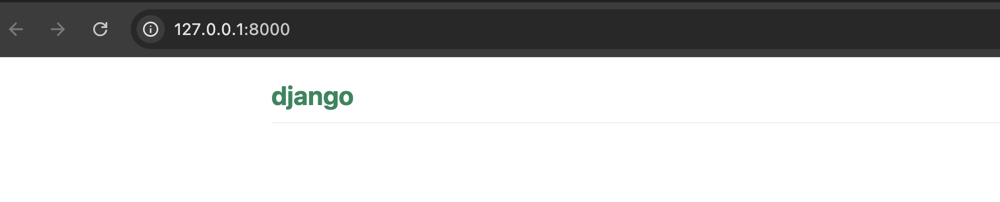

# Django URLs

We're about to build our first webpage: a homepage for your blog! But first, let's learn a little bit about Django URLs.

## What is a URL?

A URL is a web address. You can see a URL every time you visit a website – it is visible in your browser's address bar. (Yes! `127.0.0.1:8000` is a URL! And `https://shecodes.com.au/` is also a URL.)



Every page on the Internet needs its own URL. This way your application knows what it should show to a user who opens that URL. In Django, we use something called `URLconf` (URL configuration). URLconf is a set of patterns that Django will try to match the requested URL to find the correct view.

## How do URLs work in Django?

Let’s open up the `bakery_project/urls.py` file in your editor and take a look.

When you create a new Django project, Django automatically creates this file for you:


```python
"""mysite URL Configuration

[...]
"""
from django.contrib import admin
from django.urls import path

urlpatterns = [
    path('admin/', admin.site.urls),
]
```

Lines between triple quotes (`'''` or `"""`) are called docstrings – you can write them at the top of a file, class or method to describe what it does. They won't be run by Python.

The admin URL, which you visited in the previous chapter, is already here:

```python
    path('admin/', admin.site.urls),
```

The `urlpatterns` list holds all the mappings between URLs and view functions.

This line tells Django: “If someone visits a URL that starts with  `admin/`, send them to the built-in Django admin site.” Django takes care of connecting this to all the *view* needed for the admin interface behind the scenes. By keeping the admin URLs separate, it helps keep your main `urls.py` file clean and easy to read.


## Your first Django URL!

In this tutorial, we’ll set up the URL configuration for your Django project so that:

- You can access the Django admin interface
- You get a working homepage at `http://127.0.0.1:8000/`
- Your browser reloads automatically when you make changes during development

Time to create our first URL! We want 'http://127.0.0.1:8000/' to be the home page of our app and to display a list of bakeries.

In your `bakery_project/urls.py` file please add the following lines:

```python
from django.contrib import admin
-from django.urls import path
+from django.urls import path, include
+from bakeries.views import index


urlpatterns = [
    path('admin/', admin.site.urls),
+   path('', index),
]
```

The `include()` function lets you include other URL configurations from other apps.

Django will run the `index` view whenever someone goes to the homepage URL (which is just an empty string after the domain name, like `http://127.0.0.1:8000/`).


Next, we want to make our development experience smoother. One handy tool is **browser auto-reload**. This means that the browser will automatically refresh the page whenever you change your code.

To make that happen, we'll use a small Django package called `django-browser-reload`.

Before we run the server again, we need to install the django-browser-reload package. Open your terminal and run:

```
pip install django-browser-reload 
```

We also need to tell Django that it should use this package. We do that in the file `bakery_project/settings.py`, open it in your code editor. 

Then update:

In the INSTALLED_APPS list:

``` 
INSTALLED_APPS = [
    'django.contrib.admin',
    'django.contrib.auth',
    'django.contrib.contenttypes',
    'django.contrib.sessions',
    'django.contrib.messages',
    'django.contrib.staticfiles',
    'bakeries.apps.BakeriesConfig',
+    'django_browser_reload',
]

In the MIDDLEWARE list:

```
MIDDLEWARE = [
    'django.middleware.security.SecurityMiddleware',
    'django.contrib.sessions.middleware.SessionMiddleware',
    'django.middleware.common.CommonMiddleware',
    'django.middleware.csrf.CsrfViewMiddleware',
    'django.contrib.auth.middleware.AuthenticationMiddleware',
    'django.contrib.messages.middleware.MessageMiddleware',
    'django.middleware.clickjacking.XFrameOptionsMiddleware',
+    'django_browser_reload.middleware.BrowserReloadMiddleware',
]

```


Now in your `bakery_project/urls.py` file add this new line to the `urlpatterns` list:

```

from django.contrib import admin
from django.urls import path, include
from bakeries.views import index

urlpatterns = [
    path('admin/', admin.site.urls),
    path('', index),
+    path('__reload__/', include('django_browser_reload.urls')),
]

```


During development (while you're still building and testing your site), Django runs in something called DEBUG mode. 

But in DEBUG mode, Django doesn’t automatically serve files like images (media) or CSS/JavaScript (static files). So, we need to tell Django where to find these files — and make sure it only tries to serve them when DEBUG is turned on.

To do that, add the following lines to the bottom of your urls.py file:


Now, we’re going to finish up this file by making sure your project can serve images, styles, and other files correctly.

During development (when you're still building and testing your site), Django runs in something what's called `DEBUG mode`. This mode is helpful because it shows detailed error messages when things go wrong.

While in `DEBUG mode`, Django doesn’t automatically serve things like images or CSS files. To fix that, we need to tell Django where to find those files and only do that when DEBUG is on.

To do that, add the following lines to the bottom of the file:

```python

from django.contrib import admin
from django.urls import path, include
from bakeries.views import index
+from django.conf import settings
+from django.conf.urls.static import static


urlpatterns = [
    path('admin/', admin.site.urls),
    path('', index),
    path('__reload__/', include('django_browser_reload.urls')),
]

+if settings.DEBUG:
+    urlpatterns += static(settings.MEDIA_URL, document_root=settings.MEDIA_ROOT)
+    urlpatterns += static(settings.STATIC_URL, document_root=settings.STATIC_ROOT)

```

## That’s It!

You now have:

- A working homepage (`/`)
- Admin access (`/admin/`)
- Auto browser reload during development
- Static and media files being served in `DEBUG` mode

With your URLs configured, you're ready to start building out your app's logic and layout using views and templates!

> If you want to know more about Django URLconfs, look at the official documentation: https://docs.djangoproject.com/en/5.1/topics/http/urls/
