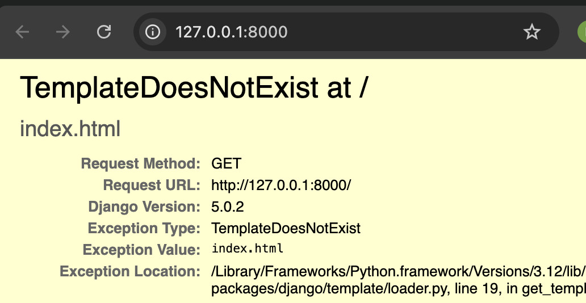

# Django views – time to create!

In the last step, we set up our *URL* so that when someone visits the homepage (http://127.0.0.1:8000/), Django knows to run a specific function called a *view*. Now it's time to create that *view*!

The *view* is the brain behind what your user see on the screen. It recieve the request. It will request information from the `model` you created before, add any extra logic (like filtering, sorting, etc.) and pass it to a `template`. We'll create a *template* in the next chapter.

Views are just Python functions that are a little bit more complicated than the ones we wrote in the Python tutorial.

Views are placed in the `views.py` file. We will add our *views* to the `bakeries/views.py` file.

## bakeries/views.py

OK, let's open up this file in our code editor and see what's in there:

```python
from django.shortcuts import render

# Create your views here.
```

Not too much stuff here yet.

Remember that lines starting with `#` are comments – this means that those lines won't be run by Python.

Let's create a *view* as the comment suggests. Add the following minimal view below it:

```python
from django.shortcuts import render

+from .models import Bakery

+def index(request):
+    context = {
+        "bakeries": Bakery.objects.all()
+    }
+    return render(request, "index.html", context)

```

As you can see, we created a function (`def`) called `index` that takes `request` and will `return` the value it gets from calling another function `render` that will render (put together) our template `bakeries/templates/index.html`.

Save the file, go to http://127.0.0.1:8000/ and see what we've got.

An Error! Read what's going on now:



This shows that the server is running again, at least, but it still doesn't look right, does it? Don't worry, it's just an error page, nothing to be scared of! Just like the error messages in the console, these are actually pretty useful. You can read that the *TemplateDoesNotExist*. Let's fix this bug and create a template in the next chapter!

> Learn more about Django views by reading the official documentation: https://docs.djangoproject.com/en/5.1/topics/http/views/
