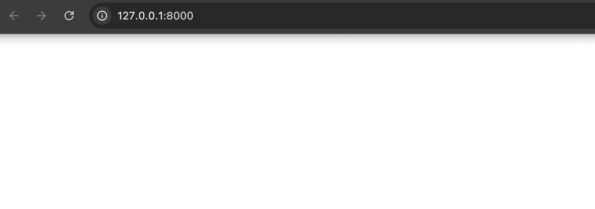
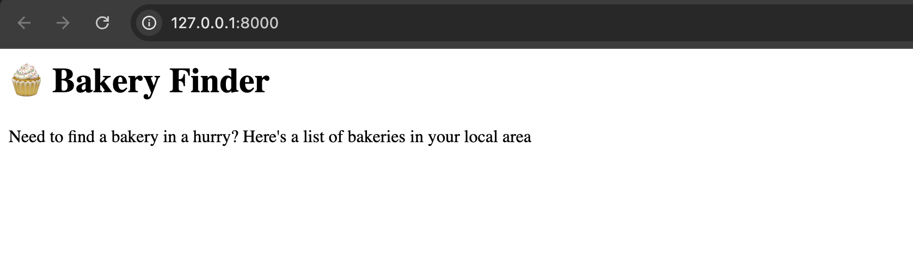
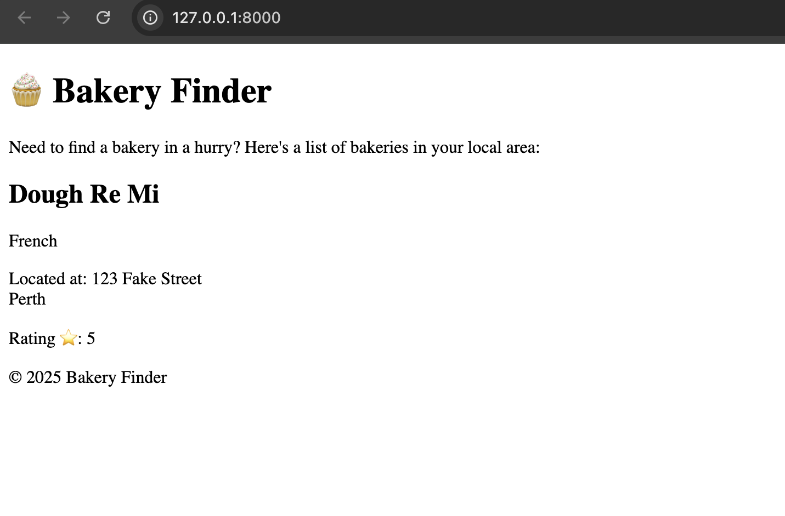
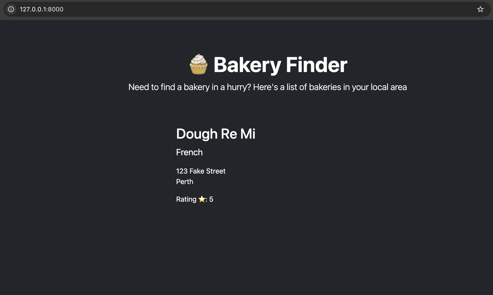

# Django Template

What's a template, you may ask?

A template is a file that we can re-use to present different information in a consistent format – for example, you could use a template to help you write a letter because although each letter might contain a different message and be addressed to a different person, they will share the same format.

A Django template's format is described in a language called HTML! If you have not already we recommend doing She Codes HTML/CSS tutorial! 

Before diving to create template, Let's make some changes in `bakery_project/settings.py`. Open the file using the code editor you installed earlier.

### Templates Directory

By default, Django already knows how to find templates stored inside each app folder. But as your project grows, it’s helpful to have a shared location where you keep your main templates.

Let’s tell Django to look inside a `templates` folder located at `bakery_project/templates/`. 

You don’t need to create the folder just yet, we’ll walk you through that later when we build your first template.

Open `settings.py`, and find the `TEMPLATES` section. Update the `'DIRS'` entry like this:

```

TEMPLATES = [
    {
        'BACKEND': 'django.template.backends.django.DjangoTemplates',
-        'DIRS': [],
+        'DIRS': [BASE_DIR / "bakery_project" / "templates"],

        'APP_DIRS': True,
        'OPTIONS': {
            'context_processors': [
                'django.template.context_processors.debug',
                'django.template.context_processors.request',
                'django.contrib.auth.context_processors.auth',
                'django.contrib.messages.context_processors.messages',
            ],
        },
    },
]

```


This tells Django to also search in this folder when rendering HTML pages.


{} Using a shared templates directory keeps things tidy, especially when building base layouts used across multiple apps. {}

## Your first template!

Creating a template means creating a template file. Everything is a file, right? You have probably noticed this already.

Let’s create `templates` folder located at `bakery_project`. In our `templates` folder create a file and name it `index.html`.

See how your website looks now: http://127.0.0.1:8000/




> **Note** If your server is not running please run server:

>windows:
>```
>python manage.py runserver
>
>```
>Mac:
>```
>python3 manage.py runserver
>
>```
>Feel free to ask any mentor if it's throwing an error! Errors are our very dear friends we need to learn how to communicate! 


No error anymore! Congratulations! :) However, your website isn't actually publishing anything except an empty page, because your template is empty too. We need to fix that.

Let's add a heading and some text! 

```
<h1>🧁 Bakery Finder</h1>

<div>
    <p>Need to find a bakery in a hurry? Here's a list of bakeries in your local area</p>
</div>

```
Don't forget to save! 

So how does your website look now? Visit it to find out: http://127.0.0.1:8000/ 




## Let’s Add a Bit More Structure and Experiment with HTML Tags


You Can:

- Use `<h1>` to `<h6>` for headings.
- Wrap sections in `<article>`, `<main>`, and `<footer>` for structure.
- Use `<ul>` and `<li>` for lists of items (like baked goods!).
- Use `<p>` for text blocks.
- Add more `<article>` sections for new bakeries!

Go ahead and play around—change names, add new bakeries, change prices. This is your page!

For your reference, check this out:

```html
<!DOCTYPE html>
<html>
  <head>
    <title>Bakery Finder</title>
  </head>
  <body>
    <header>
      <h1>🧁 Bakery Finder</h1>
    </header>

    <main>
      <p>Need to find a bakery in a hurry? Here's a list of bakeries in your local area:</p>
      
      <article>
        <h2>Sweet Treats</h2>
        <p class="description">Specializing in cupcakes and macarons 🍰</p>
        <p>Located at: 123 Tasty Street</p>
        <p>Rating ⭐: 4.8</p>
        <ul>
          <li>Chocolate Cupcake - $3.50</li>
          <li>Vanilla Macaron - $2.00</li>
        </ul>
      </article>

      <article>
        <h2>Bakehouse Delight</h2>
        <p class="description">Fresh croissants and artisan bread 🥐</p>
        <p>Located at: 456 Crusty Avenue</p>
        <p>Rating ⭐: 4.6</p>
        <ul>
          <li>Butter Croissant - $4.00</li>
          <li>Sourdough Loaf - $6.50</li>
        </ul>
      </article>
    </main>

    <footer>
      <p>© 2025 Bakery Finder</p>
    </footer>
  </body>
</html>
```


## Adding Django Data – Make It Dynamic!

Right now, the data on your page is hardcoded. But Django is all about **dynamic content** meaning you can pull real data from your database and render it with your template.

So let’s replace our sample bakeries with a smart Django loop that pulls real bakery info from your models.


```django

+ 

<!DOCTYPE html>
<html lang="en">
  <head>
    <meta charset="utf-8">
    <title>Bakery Finder</title>
  </head>
  <body>
    <header>
      <h1>🧁 Bakery Finder</h1>
    </header>

    <main>
      <p>Need to find a bakery in a hurry? Here's a list of bakeries in your local area:</p>

-     <article>
-       <h2>Sweet Treats</h2>
-       <p class="description">Specializing in cupcakes and macarons 🍰</p>
-       <p>Located at: 123 Tasty Street</p>
-       <p>Rating ⭐: 4.8</p>
-       <ul>
-         <li>Chocolate Cupcake - $3.50</li>
-         <li>Vanilla Macaron - $2.00</li>
-       </ul>
-     </article>

-     <article>
-       <h2>Bakehouse Delight</h2>
-       <p class="description">Fresh croissants and artisan bread 🥐</p>
-       <p>Located at: 456 Crusty Avenue</p>
-       <p>Rating ⭐: 4.6</p>
-       <ul>
-         <li>Butter Croissant - $4.00</li>
-         <li>Sourdough Loaf - $6.50</li>
-       </ul>
-     </article>

+     
+       <article>
+         <h2>{{ bakery.name }}</h2>
+         <p class="description">{{ bakery.cuisine }}</p>
+         <p>Located at: {{ bakery.address|linebreaksbr }}</p>
+         <p>Rating ⭐: {{ bakery.rating }}</p>
+         <ul>
+           
+             <li>{{ item.name }} - ${{ item.price }}</li>
+           
+         </ul>
+       </article>
+     
+       <p>No bakeries found. Add some via the admin panel!</p>
+     
    </main>

    <footer>
      <p>© 2025 Bakery Finder</p>
    </footer>
  </body>
</html>

```

At the **very top** of your template file, add this line:``.
This tells Django to prepare for using static files — like CSS stylesheets, images, or JavaScript.

##  What’s Going On Here?

Let's break down the Django template tags and expressions used in your dynamic page.

- ``  
  → This starts a loop that runs once for **every bakery** in your database. Django will automatically pass the list of bakeries from your view function to this template.

- `{{ bakery.name }}`  
  → This grabs the name of each bakery and displays it in an `<h2>` heading.

- `{{ bakery.cuisine }}`  
  → Maybe they do cupcakes, croissants, sourdough — we’re showing off their specialty.

- `{{ bakery.address|linebreaksbr }}`  
  → The address might have line breaks, and `|linebreaksbr` helps format it nicely with `<br>` tags.

- `{{ bakery.rating }}`  
  → Yep, we’re even showing the star rating!

- ``  
  → This is a **nested loop** that lists each item (like cupcakes, bread, or macarons) that belongs to the current bakery. Django knows the relationship because of your model setup (ForeignKey from `Item` to `Bakery`).

- ``  
  → Super friendly UX: if your database doesn’t have any bakeries yet, Django will show a helpful message.

- ``  
  → This wraps up the loop.

---
let's go ahead and check your server http://127.0.0.1:8000/





## Want to Make it Prettier? Use Bootstrap!

If you're happy with the functionality but want to **upgrade your design**, you can add [Bootstrap](https://getbootstrap.com) – a powerful CSS framework that makes styling easy and beautiful.

Here’s a fully styled version using Bootstrap. Feel free to **copy, paste, and tweak it**:

```django


<!doctype html>
<html lang="en">

<head>
    <meta charset="utf-8">
    <meta name="viewport" content="width=device-width, initial-scale=1">
    <meta name="description" content="Bakery Finder App">
    <title>{{ title }} | Bakery Finder</title>
    
    <link href="https://cdn.jsdelivr.net/npm/bootstrap@5.3.3/dist/css/bootstrap.min.css" rel="stylesheet">
</head>

<body class="text-bg-dark">
    <div class="p-4 mt-5 text-center">
        <h1 class="display-5 fw-bold">🧁 Bakery Finder</h1>
        <div class="col-lg-6 mx-auto">
            <p class="lead mb-4">Need to find a bakery in a hurry? Here's a list of bakeries in your local area</p>
        </div>
    </div>

    <div class="container">
        
            <div class="row py-4">
                <div class="col-md-4"></div>
                <div class="col-md-4">
                    <h2>{{ bakery.name }}</h2>
                    <p class="fs-5">{{ bakery.cuisine }}</p>
                    <p>{{ bakery.address|linebreaksbr }}</p>
                    <p>Rating ⭐: {{ bakery.rating }}</p>
                    <ol class="list-group list-group-flush">
                        
                            <li class="list-group-item list-group-item-dark list-group-item-action">
                                {{ item.name }}: ${{ item.price }}
                            </li>
                        
                    </ol>
                </div>
                <div class="col-md-4"></div>
            </div>
        
    </div>
</body>

</html>
```

**Pro tip**: Bootstrap makes it easier to build responsive, mobile-friendly pages without writing much CSS. Once you're comfortable with HTML, you can explore Bootstrap components like cards, buttons, or modals.


Now, every time you add a new bakery via the admin, it’ll automatically show up here! This is where Django starts feeling like magic ✨

Let's go ahead and check your server http://127.0.0.1:8000/ 





Now let's go to admin http://127.0.0.1:8000/admin . Login with your superuser credentials. Remember in admin section [Go to the Admin Section Tutorial](../03_djanago_admin/03_djanago_admin.md) where we played around and added some bakery details? It's time to add more and watch it come to live! 


## One more thing

It'd be good to see if your website will still be working on the public Internet, right? Let's try deploying to PythonAnywhere again. Here's a recap of the steps. In your **VS Code terminal**, stop the server from running by pressing:`Ctrl + C`.

* Now, push your code to GitHub

command-line
```
$ git status
[...]
$ git add .
$ git status
[...]
$ git commit -m "Modified templates to display posts from database."
[...]
$ git push
```

If you need a recap of what we are doing, check [First Git commands](../04_deploy/04_deploy.md#first-git-commands). Remember mentors are just a hand raise away. Don’t hesitate to ask for help if you get stuck!

* Then, log back in to [PythonAnywhere](https://www.pythonanywhere.com/consoles/) and go to your **Bash console** (or start a new one), and run:

PythonAnywhere command-line
```
$ cd <your-pythonanywhere-domain>.pythonanywhere.com
$ git pull
[...]
```

(Remember to substitute `<your-pythonanywhere-domain>` with your actual PythonAnywhere subdomain, without the angle-brackets.)

* Finally, hop on over to the ["Web" page](https://www.pythonanywhere.com/web_app_setup/) and hit **Reload** on your web app. (To reach other PythonAnywhere pages from the console, use the menu button in the upper right corner.) Your update should be live on https://subdomain.pythonanywhere.com -- check it out in the browser! If the blog posts on your PythonAnywhere site don't match the posts appearing on the blog hosted on your local server, that's OK. The databases on your local computer and Python Anywhere don't sync with the rest of your files.


Congrats! Now go ahead and try adding a new post in your Django admin (remember to add published_date!) Make sure you are in the Django admin for your pythonanywhere site, https://subdomain.pythonanywhere.com/admin. Then refresh your page to see if the post appears there.

Works like a charm? We're proud! Step away from your computer for a bit – you have earned a break. :)


