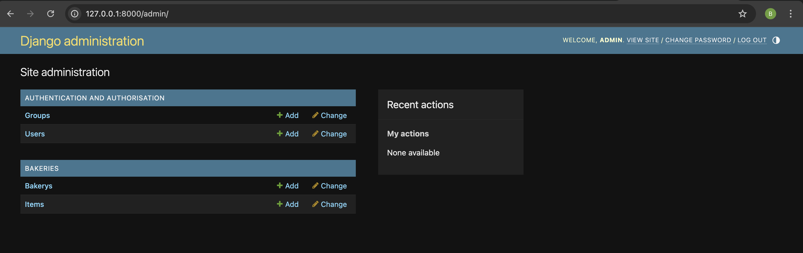

# Django admin
<!-- comment baraye behnaz : tutorial bakery app ro baz kon, oon ke khodam sakhtam ham baz kon taa code ro bezani az roosh, va ax begiri ax vaa coode ro inja update kon -->
To add, edit and delete the posts we've just modeled, we will use Django admin.

Let's open the `{{APP_NAME}}/admin.py` file in the code editor and replace its contents with this:


```python
from django.contrib import admin

from .models import Bakery, Item


admin.site.register(Bakery)
admin.site.register(Item)

```

As you can see, we import (include) the Bakery and Item models defined in the previous chapter. To make our models visible on the admin page, we need to register the model with `admin.site.register(Bakery)` and `admin.site.register(Item)`.

OK, time to look at our Bakery and Item models. Remember to run `python manage.py runserver` in the console to run the web server. Go to your browser and type the address http://127.0.0.1:8000/admin/. You will see a login page like this:


To log in, you need to create a *superuser* - a user account that has control over everything on the site. Go back to the command line type `python manage.py createsuperuser`, and press enter.

{}

Remember, to write new commands while the web server is running, open a new terminal window and activate your virtualenv. We reviewed how to write new commands in the <b>Your first Django project!</b> chapter, in the <b>Starting the web server</b> section.

{}

macOS or Linux:
```
(myvenv) {{PROJECT_DIRECTORY}}% python manage.py createsuperuser
```

Windows:
```
(myvenv) ~/{{PROJECT_DIRECTORY}}$ python manage.py createsuperuser
```

When prompted, type your username (lowercase, no spaces), email address, and password. **Don't worry that you can't see the password you're typing in – that's how it's supposed to be.** Type it in and press `enter` to continue. The output should look like this (where the username and email should be your own ones):

```
Username: ola
Email address: ola@example.com
Password:
Password (again):
Superuser created successfully.
```

Return to your browser. Log in with the superuser's credentials you chose; you should see the Django admin dashboard.



Go to Bakery and experiment a little bit with it. Add two or three bakery. Don't worry about the content –- it's only visible to you on your local computer -- you can copy-paste some text from this tutorial to save time. Now head to Item and add some items for each bakery! :)


If you want to know more about Django admin, you should check Django's documentation: https://docs.djangoproject.com/en/5.1/ref/contrib/admin/

This is probably a good moment to grab a coffee (or tea) or something to eat to re-energize yourself. You created your first Django model – you deserve a little break!
