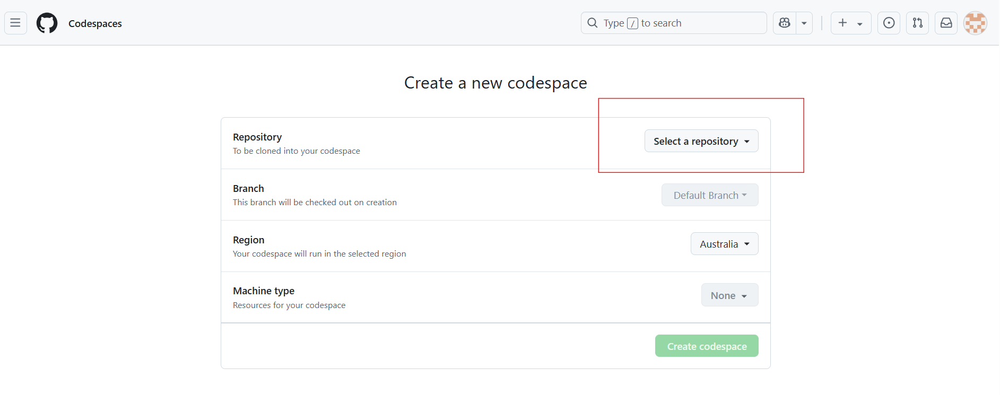
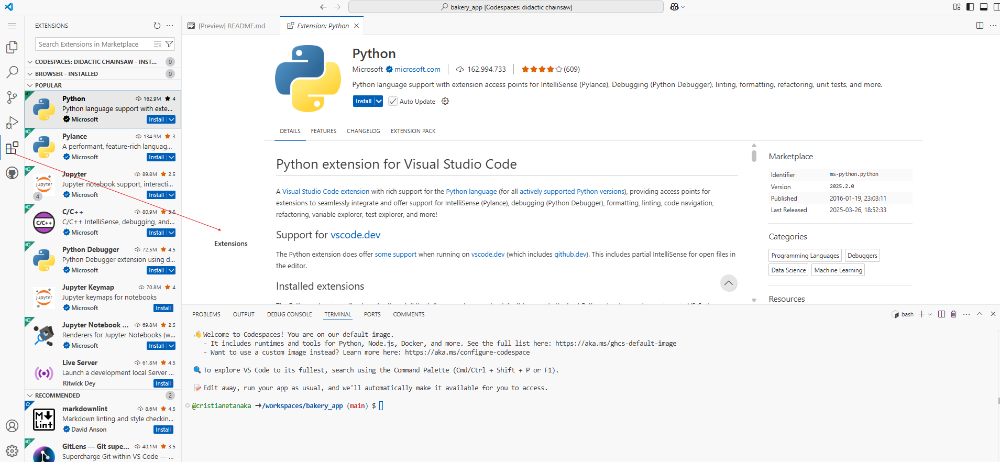
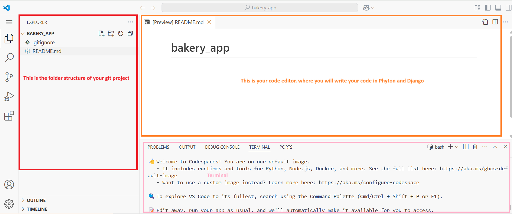
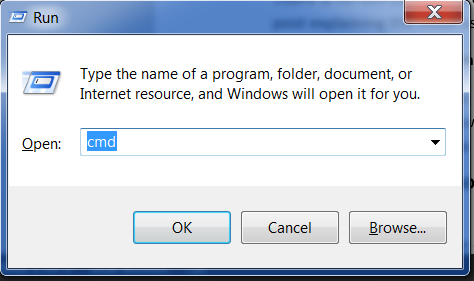

# Installation

In this tutorial you will be building a Bakery app. In order to do that, as you go through the tutorial you'll be instructed on how to
install various software on your computer and set up some online accounts as needed (if you are using local desktop environment) or instructed on how to create online accounts only (if you are using cloud development). This page gathers all of the installation and sign-up instructions in one place .

# Chromebook Installation
To set up your Chromebook, follow the instructions below:

## Using a Cloud IDE Environment (Recommended for Chromebook or Low-Memory Devices)

For users on Chromebooks or laptops with limited memory, we recommend using a **cloud IDE environment**. This allows you to interact with the command line, Python, and Django directly through your browser, with a code editor already installed.

Your installation experience may differ slightly depending on the environment.

---

## Step 1: Create a GitHub Account (if you already don't have one)

1. Go to [GitHub.com](https://github.com) and sign up for a **free** user account.
2. Remember your password — consider saving it in a password manager if you use one.

---

## Step 2: Create a GitHub Project

1. Visit [this link](https://github.com/new) to create a new repository.
2. Use **`bakery_app`** as the project name.
3. Set the repository to **Public** (this is required for deployment; you can make it private later).
4. In Initialize this repository with, make sure to:
   - Add a **README.md** file.
   - Add a **.gitignore** file and select Python.

## Step 3:  Start a Codespace

If you don't want to install any app in your laptop, you can install Codespaces. To install Codespaces

1. Go to GitHub [Codespaces](https://github.com/codespaces/new) and select the repository you just created. Click 'Create Codespace'

wait a little bit and you will see something like that

The [VSCode] (https://code.visualstudio.com/docs/?dv=win64user) editor will open for you automatically.
If you see a notification that says "Install Python", please click on it. If not prompted, click the "Extensions" icon on the left sidebar in the Codespace editor. Search for "Python" and click "Install."

The bash terminal(similar to Linus) is at the bottom page.

By default, the GitHub Codespace environment will be deleted after 1 month (this applies only to the environment, not your code). To prevent auto-deletion, you can adjust the settings on the page: https://github.com/codespaces

## Step 4: Continue with the Tutorial.
Follow the next steps from the section Set up a virtual environment and install Django.
Follow than sections for Ubuntu/Linux. Use the Codespaces command line (terminal), accessible through your browser.

<!--endsec-->

# macOS, Windows, Linux Installation {#macos-windows-linux}
If you are not using a Chromebook, your experience will be a little different as you need to download and install some software locally as well as set up online accounts.

To install software on your machine, follow the instructions below:

## Brief intro to the command line {#intro-command-line}
Many of the steps below reference the "console", "terminal", "command window", or "command line" -- these all mean the same thing: a window on your computer where you can enter commands. When you get to the main tutorial, you'll learn more about the command line. For now, the main thing you need to know is how to open a command window and what it looks like:

Opening:macOS
Go to Launchpad --> Other -->Terminal

Opening: Linux
It's probably under applications --> Acessories --> Terminal, or Applications --> System --> Terminal, but that may depend on your system. If It's not there, you can try to Google it.

Opening: Windows

Depending on your version of Windows and your keyboard, one of the following should open a command window (you may have to experiment a bit, but you don't have to try all of these suggestions):

* Go to the Start menu or screen, and enter "Command Prompt" in the search field.
* Go to Start menu → Windows System → Command Prompt.
* Go to Start menu → All Programs → Accessories → Command Prompt.
* Go to the Start screen, hover your mouse in the lower-left corner of the screen, and click the down arrow that appears (on a touch screen, instead flick up from the bottom of the screen). The Apps page should open. Click on Command Prompt in the Windows System section.
* Hold the special Windows key on your keyboard and press the "X" key. Choose "Command Prompt" from the pop-up menu.
* Hold the Windows key and press the "R" key to get a "Run" window. Type "cmd" in the box, and click the OK key.

Later in this tutorial, you will need to have two command windows open at the same time. However, on some versions of Windows, if you already have one command window open and you try to open a second one using the same method, it will instead point you to the command window you already have open. Try it now on your computer and see what happens! If you only get one command window, try one of the other methods in the list above. At least one of them should result in a new command window being opened.

## Install Python {#python}

Django is written in Python. We need Python to do anything in Django. Let's start by installing it! We want you to install the latest version of Python 3, so if you have any earlier version, you will need to upgrade it. If you already have version 3.10 or higher you should be fine.

Please install normal Python as follows, even when you have Anaconda installed on your computer.

For python installation please see the [Python tutorial](https://tutorials.shecodes.com.au/python/getting_started/1_python_installation/)

## Install a code editor {#code-editor}

There are a lot of different editors and it largely boils down to personal preference. Most Python programmers use complex but extremely powerful IDEs (Integrated Development Environments), such as PyCharm. As a beginner, however, that's probably less suitable; our recommendations are equally powerful, but a lot simpler.

Our suggestions are below, but feel free to ask one of the mentors what their preferences are – it'll be easier to get help from them.

VS Code

To install VS Code please see [VS Code tutorial](https://tutorials.shecodes.com.au/python/getting_started/2_code_editor/)

## Why are we installing a code editor?

You might be wondering why we are installing this special code editor software, rather than using something like Word or Notepad.

The first reason is that code needs to be plain text, and the problem with programs like Word and Textedit is that they don't actually produce plain text, they produce rich text (with fonts and formatting), using custom formats like RTF (Rich Text Format).

The second reason is that code editors are specialized for editing code, so they can provide helpful features like highlighting code with color according to its meaning, or automatically closing quotes for you.

We'll see all this in action later. Soon, you'll come to think of your trusty old code editor as one of your favorite tools. 

## Set up virtualenv and install Django {#virtualenv}

## Virtual environment

Before we install Django we will get you to install an extremely useful tool to help keep your coding environment tidy on your computer. It's possible to skip this step, but it's highly recommended to follow it. Starting with the best possible setup will save you a lot of trouble in the future!

So, let's create a virtual environment (also called a virtualenv). Virtualenv will isolate your Python/Django setup on a per-project basis. This means that any changes you make to one website won't affect any others you're also developing. Neat, right?

All you need to do is find a directory in which you want to create the virtualenv; your home directory, for example. On Windows, it might look like C:\Users\Name\ (where Name is the name of your login).

NOTE: On Windows, make sure that this directory does not contain accented or special characters; if your username contains accented characters, use a different directory, for example, C:\bakeryapp.

For this tutorial we will be using a new directory bakeryapp from your home directory:

command-line
$ mkdir bakeryapp
$ cd bakeryapp

We will make a virtualenv called myvenv. The general command will be in the format:

command-line
$ python3 -m venv myvenv

Virtual environment: Windows

To create a new virtualenv, you need to open the command prompt and run python -m venv myvenv. It will look like this:

command-line
C:\Users\Name\bakeryapp> python -m venv myvenv

Where myvenv is the name of your virtualenv. You can use any other name, but stick to lowercase and use no spaces, accents or special characters. It is also a good idea to keep the name short – you'll be referencing it a lot!

Virtual environment: Linux and macOS

We can create a virtualenv on both Linux and macOS by running python3 -m venv myvenv. It will look like this:

command-line
$ python3 -m venv myvenv

myvenv is the name of your virtualenv. You can use any other name, but stick to lowercase and use no spaces. It is also a good idea to keep the name short as you'll be referencing it a lot!

NOTE: On some versions of Debian/Ubuntu you may receive the following error:

command-line

The virtual environment was not created successfully because ensurepip is not available.  On Debian/Ubuntu systems, you need to install the python3-venv package using the following command.
   apt install python3-venv
You may need to use sudo with that command.  After installing the python3-venv package, recreate your virtual environment.

In this case, follow the instructions above and install the python3-venv package:

command-line
$ sudo apt install python3-venv

NOTE: On some versions of Debian/Ubuntu initiating the virtual environment like this currently gives the following error:

command-line
Error: Command '['/home/eddie/Slask/tmp/venv/bin/python3', '-Im', 'ensurepip', '--upgrade', '--default-pip']' returned non-zero exit status 1

To get around this, use the virtualenv command instead.

command-line
$ sudo apt install python-virtualenv
$ virtualenv --python=python3.12 myvenv

NOTE: If you get an error like

command-line
E: Unable to locate package python3-venv

then instead run:

command-line
sudo apt install python3.12-venv

## Working with virtualenv

The command above will create a directory called myvenv (or whatever name you chose) that contains our virtual environment (basically a bunch of directories and files).

Working with virtualenv: Windows

Start your virtual environment by running:

command-line
C:\Users\Name\djangogirls> myvenv\Scripts\activate

NOTE: On Windows 10 you might get an error in the Windows PowerShell that says execution of scripts is disabled on this system. In this case, open another Windows PowerShell with the "Run as Administrator" option. Then try typing the following command before starting your virtual environment:

command-line
C:\WINDOWS\system32> Set-ExecutionPolicy -ExecutionPolicy RemoteSigned
    Execution Policy Change
    The execution policy helps protect you from scripts that you do not trust. Changing the execution policy might expose you to the security risks described in the about_Execution_Policies help topic at https://go.microsoft.com/fwlink/?LinkID=135170. Do you want to change the execution policy? [Y] Yes  [A] Yes to All  [N] No  [L] No to All  [S] Suspend  [?] Help (default is "N"): A

NOTE: For users of the popular editor VS Code, which comes with an integrated terminal based off windows PowerShell, if you wish to stick with the integrated terminal, you may run the following command to activate your virtual environment:

$ . myvenv\Scripts\activate.ps1

The advantage is that you don't have to switch between editor windows and command-line windows

Working with virtualenv: Linux and macOS

Start your virtual environment by running:

command-line
$ source myvenv/bin/activate

Remember to replace myvenv with your chosen virtualenv name!

NOTE: If the command source is not available, try doing this instead:

command-line
$ . myvenv/bin/activate

You will know that you have virtualenv started when you see that the prompt in your console is prefixed with (myvenv).

When working within a virtual environment, python will automatically refer to the correct version so you can use python instead of python3.

OK, we have all important dependencies in place. We can finally install Django!

## Installing Django

Now that you have your virtualenv started, you can install Django.

Before we do that, we should make sure we have the latest version of pip, the software that we use to install Django:

command-line
(myvenv) ~$ python -m pip install --upgrade pip

## Installing packages with requirements

A requirements file keeps a list of dependencies to be installed using pip install:

First create a requirements.txt file inside of the bakeryapp/ folder, using the code editor that you installed earlier. You do this by opening a new file in the code editor and then saving it as requirements.txt in the djangogirls/ folder. Your directory will look like this:

djangogirls
├── myvenv
│   └── ...
└───requirements.txt

In your djangogirls/requirements.txt file you should add the following text:

bakeryapp/requirements.txt
Django~=5.1.2

Now, run pip install -r requirements.txt to install Django.

command-line
(myvenv) ~$ pip install -r requirements.txt
Collecting Django~=5.1.2 (from -r requirements.txt (line 1))
  Downloading Django-5.1.2-py3-none-any.whl (7.9MB)
Installing collected packages: Django
Successfully installed Django-5.1.2

Installing Django: Windows

If you get an error when calling pip on Windows, please check if your project pathname contains spaces, accents or special characters (for example, C:\Users\User Name\bakeryapp). If it does, please consider using another place without spaces, accents or special characters (suggestion: C:\bakeryapp). Create a new virtualenv in the new directory, then delete the old one and try the above command again. (Moving the virtualenv directory won't work since virtualenv uses absolute paths.)

Installing Django: Windows 8 and Windows 10

Your command line might freeze when you try to install Django. If this happens, instead of the above command use:

command-line
C:\Users\Name\bakeryapp> python -m pip install -r requirements.txt

Installing Django: Linux

If you get an error when calling pip on Ubuntu 12.04 please run python -m pip install -U --force-reinstall pip to fix the pip installation in the virtualenv.

That's it! You're now (finally) ready to create a Django application!

## Install Git {#git}

Git is a "version control system" used by a lot of programmers. This software can track changes to files over time so that you can recall specific versions later. A bit like the "track changes" feature in word processor programs (e.g., Microsoft Word or LibreOffice Writer), but much more powerful.

## Installing GIT

Installing Git: Windows

You can download Git from [git-scm.com](https://git-scm.com/). You can hit "next" on all steps except for two: in the step where it asks to choose your editor, you should pick Nano, and in the step entitled "Adjusting your PATH environment", choose "Use Git and optional Unix tools from the Windows Command Prompt" (the bottom option). Other than that, the defaults are fine. Checkout Windows-style, commit Unix-style line endings is good.

Do not forget to restart the command prompt or PowerShell after the installation finished successfully.

## Installing Git:macOS

Download Git from https://git-scm.com/download/mac and follow the instructions.

Note If you are running OS X 10.6, 10.7, or 10.8, you will need to install the version of git from here: Git installer for OS X Snow Leopard

It is recommended to install using brew (you may need to install homebrew if you don't already have it): 
brew install git

Please note that some Mac M1/M2/M3 users may have the error zsh: command not found: brew. In that case, please follow [this](https://stackoverflow.com/questions/36657321/after-installing-homebrew-i-get-zsh-command-not-found-brew/66019047#66019047) or [this](https://mac.install.guide/homebrew/zsh-command-not-found-brew) to fix the error.

Installing Git: Debian or Ubuntu

command-line
$ sudo apt install git

Installing Git: Fedora

command-line
$ sudo dnf install git

Installing Git: openSUSE

command-line
$ sudo zypper install git

## Create a GitHub account 

Go to [GitHub.com](https://www.github.com) and sign up for a new, free user account. Be sure to remember your password (add it to your password manager, if you use one).
