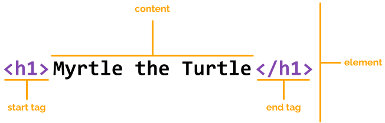

Webpages are made up of **elements**.
There are many different elements that we can use, but we're just going to look at a handful of them.

Every element has a name, and is (usually) made up of an opening and closing tag, with the content we want displayed on the screen between them.

We've actually already written an element.
"Our First Webpage" used an `h1` tag, otherwise known as a heading tag.

