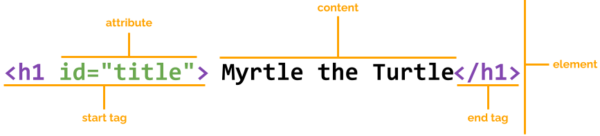

As we've learned, webpages are made up of **elements**.
We've looked at just a handful of elements so far.

So far our elements have consisted of a tag name and content.
But elements can also have what we call **attributes**. Attributes allow us to define more information about the element.
We do this by adding the `attribute` to the opening tag and providing a `value` inside of quotes.

For example, the following is an `h1` element with an `id` attribute of value `title`:

Next we'll take a look at a couple of elements which require attributes.

{}

If you try adding the `id` attribute to your `h1` tag (like in the example above), nothing will actually happen.
Some attributes require some CSS before they will actually do something, more on that later...

{}
