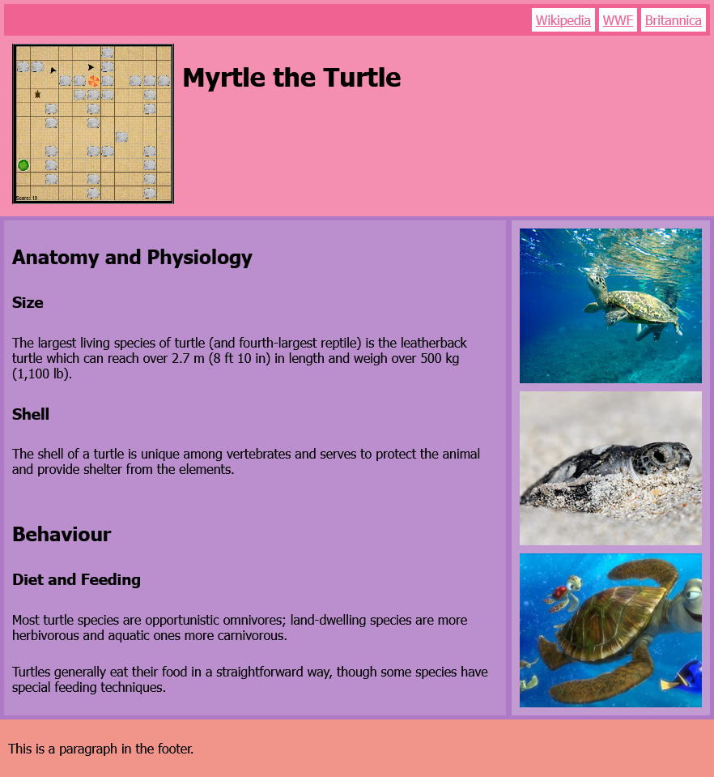
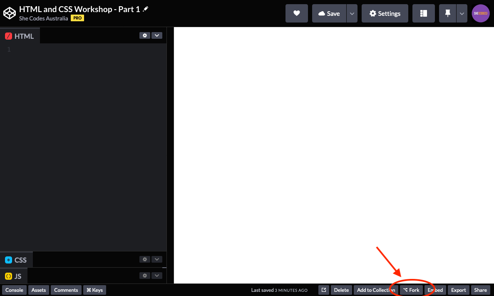

So far we’ve learnt a couple of different elements, but HTML isn’t just about defining the content of the page - it is also used to define the page structure.
We can also use HTML elements to give the browser information about the structure of the page, and other information it needs to display your website.

One of the reasons we're using Codepen is because it takes care of a lot of the work for us in setting up the HTML page.
But when we start from scratch, the first element we need to include on our page is the `html` element, and all our website content will go inside that element.

```html
<html>
    <!-- Page content goes here -->
</html>
```

Inside this, we have our `head` element, which we can use to give the browser information about our webpage.
Content in the `head` won’t appear on the page, but it is where we can give information to the browser (in a format it can understand) about things like the page title and any external code that needs to be loaded.

```html
<html>
    <head>
        <!-- There is info for the browser here -->
    </head>
</html>
```

Most of our content goes inside the `body` element.
This is content for the user which is typically visible in the browser.

```html
<html>
    <head>
        <!-- There is info for the browser here -->
    </head>
    <body>
        <!-- Visible page content goes here -->
    </body>
</html>
```

Fortunately, Codepen takes care of a lot of this structure for us, so we only have to worry about the visible page content.
All the HTML we write is being put inside the `body` element.

Next, we are going to learn how to structure the content in the `body`.

To do this, we are going to build a webpage step by step.
When we're done, our page will look like this:



We've already written some CSS for you, this is what gives the page colour and layout.
You’ll be learning more about this soon!

You'll know if you've built your page correctly because it should look identical in colour and layout to the above screenshot.

Once again, we've created a template for you to get started with.
Open the template by [clicking this link](https://codepen.io/shecodesaus/pen/MWOOeoZ).

Once you've opened the pen, click the `fork` button on the bottom right of the page to make a copy of the pen under your account.

TODO should be template 2 screenshot.



