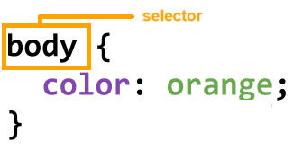

There are two parts to CSS: selectors and declarations.
We'll just focus on selectors for now.
The selector tells the webapge which part of the page to apply the styles (declarations) to.

There are three different kinds of selectors:
- Tag
- ID
- Class
