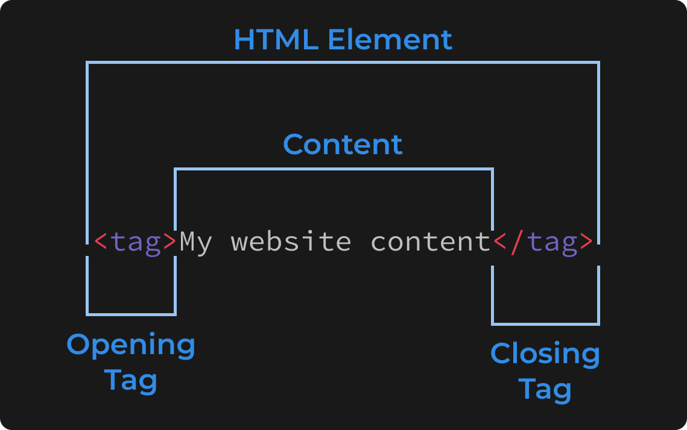

+++
title = "How to write HTML"
weight = 2
chapter = true
pre = "<b>2. </b>"
+++

# How to write HTML

There are two different kinds of HTML elements, the most common one is a **open/close** element, which looks like this:

We write our content between two HTML tags (an opening and a closing tag), which are identified by a tag name, eg. `element`, wrapped in `<` and `>` angle brackets (you might know them as the *greater than* and *less than* symbols or chevrons).

There's one difference between the opening and closing tags, as the closing tag has a forward slash (`/`) before the tag name, to let the browser know that it's a closing tag, and our content is finished.

The other kind of HTML element is a **self-closing** element, which doesn't require a closing tag, but instead has a forward slash (`/`) before the second chevron.

We'll look at self-closing elements a bit more later, and how we can give them content without putting it between two HTML tags.