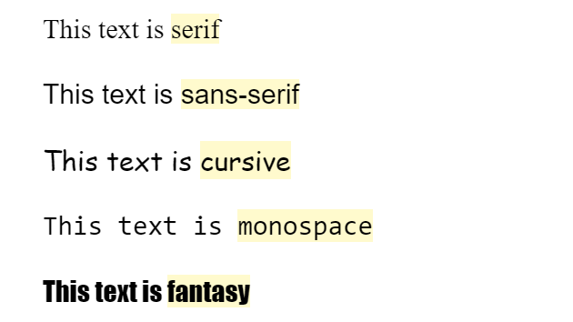

+++
title = "Font Family"
weight = 4
chapter = true
pre = "<b>4. </b>"
+++

# Font Family

Now we're on to the fun bit. While changing the size, weight and style of our font is fun, we also want to be able to change the font that we're using, and we can do that using the `font-family` property.

Without even looking at using an external font, our browser is already set up with a few different generic fonts that we can use.



```css
 p {
	 font-family: cursive;
 }
```

Try changing the `font-family` in the Codepen below, remembering the browser has set fonts for `serif` `sans-serif`, `cursive`, `monospace` and `fantasy`.



{}
This will look different depending on your browser or computer, so don't be concerned if yours looks different to the example, or other participants.
{}

While using these five set fonts could be fun, we can also use external fonts that we load in to our pages. We've already set this Codepen up to do this, so you can also choose from the following fonts:


```css
h1 {
	font-family: 'Press Start 2P';
}

h2 {
	font-family: Arvo;
}

p {
	font-family: 'Great Vibes';
}
```

{}
If the name of the font family (eg. `Great Vibes`), is more than one word, make sure you wrap it in quotes (either single, `'`, or double, `"`).
{}

Try changing the fonts again, but this time choose from our external fonts.


