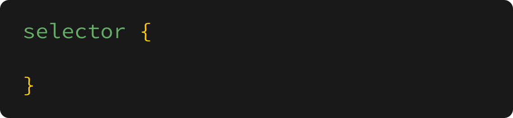
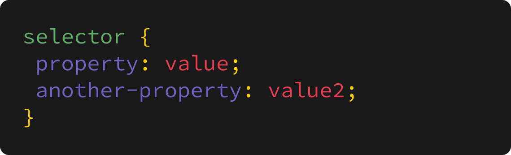

+++
title = "How to write CSS"
weight = 2
chapter = true
pre = "<b>2. </b>"
+++

# How to write CSS

When we write CSS, we use a CSS selector, to let the browser know what element we want to style, we then use curly brackets (`{` and `}`) to wrap around the CSS styles that we write.

Inside of these brackets, we can change CSS properties using a **property** and **value**, with a colon after the property, and a semi-colon at the end of the line (to tell the browser that we've finished with that CSS property)

We can combine these two, so that our properties are nested inside the curly braces. Typically CSS properties will use hyphens (`-`) between any words, and won't contain any spaces.

There are a few different selectors that we can use, but for now we're going to use our HTML tags to reference which element we want to style, eg.

