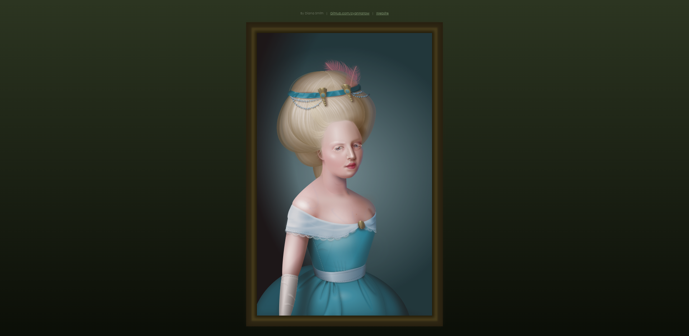

+++
title = "Why should you know CSS?"
weight = 1
chapter = true
pre = "<b>1. </b>"
+++

# Why should you know CSS?

CSS gives us superpowers to dramatically change the way a website looks and feels, without having to change any of the HTML.

Have a look at [stylestage.dev](https://stylestage.dev), this is a project that has multiple versions of the site, each using the exact same HTML code, but with different CSS styles.

You can even get really fancy and use CSS to create artwork, [Diana Smith](https://diana-adrianne.com/purecss-francine/) has done some amazing artwork, all with just HTML and CSS.

