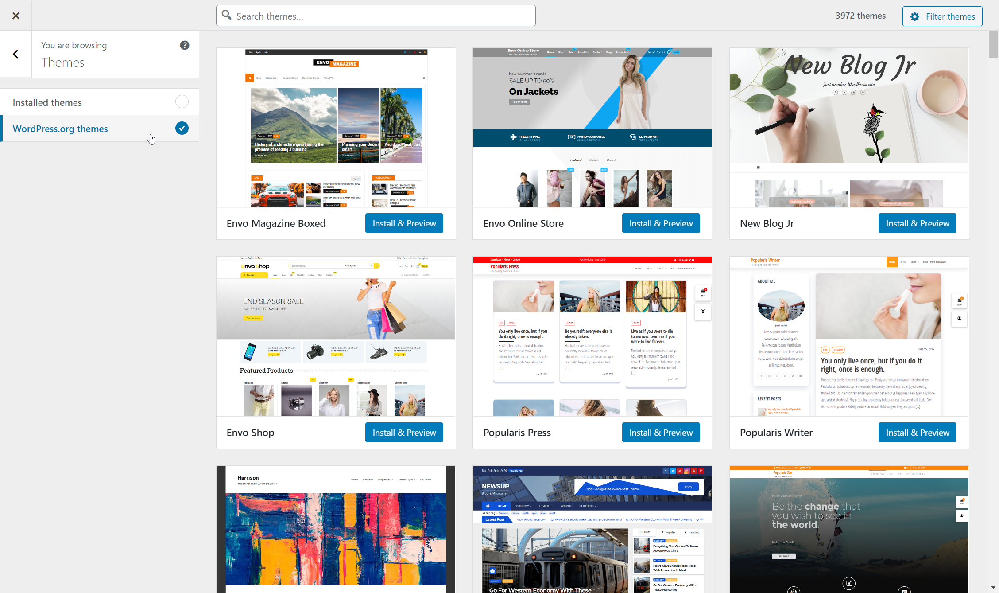
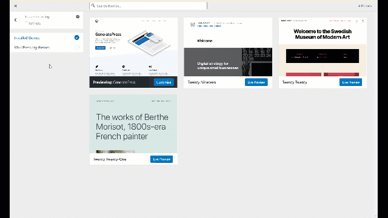
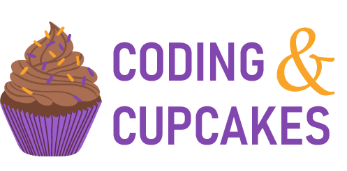
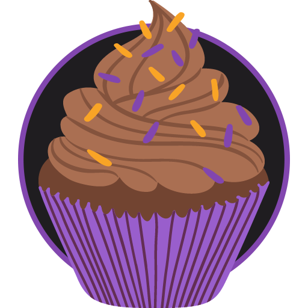
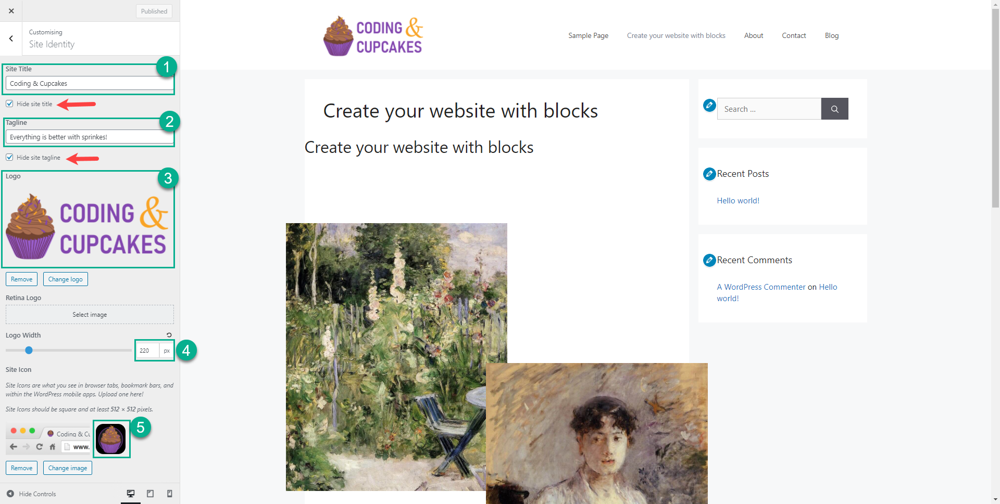
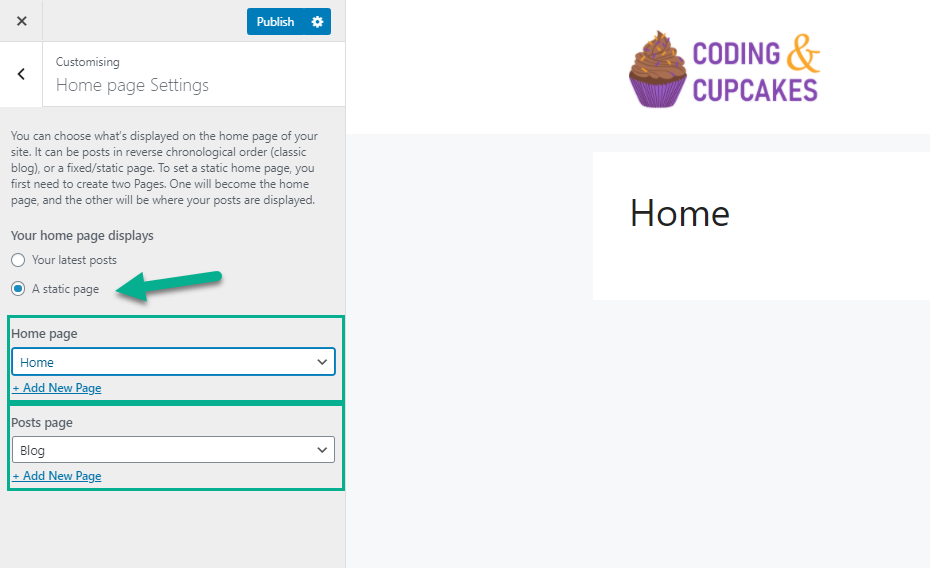
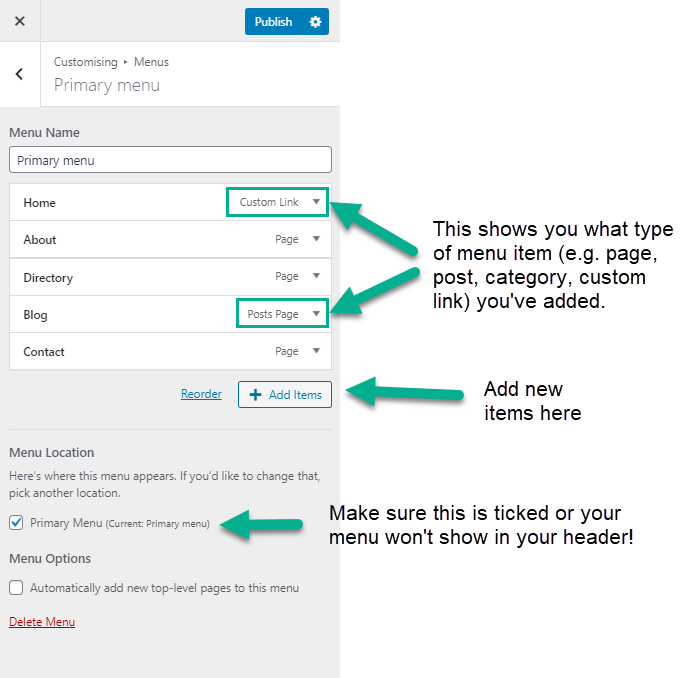

+++
title = "Adding Flavour"
weight = 3
chapter = true
pre = "<b>3. </b>"
+++

The first thing we are going to do is install a theme and familiarise ourselves with some of the basic settings of WordPress. While it's important that you know where to find these settings, it's very easy to full into a rabbit hole once you start playing around with them. We recommend that you spend no more than 10 minutes playing around with these options, and come back to them later!

# The WordPress Customiser

There are a few ways you can access the WordPress customiser, which is where we are going to start making our site our own. You can either:

1. Access it by clicking the 'Customise Your Site' button on the dashboard
2. From the dashboard sidebar, go to Appearance > Customise
3. From the front-end of your website, choose the 'Customise' option from the toolbar


Once you are in the customiser, you will see your active theme, some options below that, and at the bottom of the screen - some icons of various devices. Clicking the different devices will change the preview size of the screen on the right, to allow you to check how your site performs on different screen sizes.

## Changing themes

The theme that is currently installed on your website is the latest WordPress default theme. It will be called something like 'Twenty Twenty-One.' To replace this theme with a different one from the WordPress repository, you can hit the Change button next to your theme. You will see any installed themes (there may be more than one) and on the left, an option to view more themes on the repository. Choose the 'WordPress.org themes' option to view the repository.

Don't spend too long browsing themes! In the following sections we'll show you lots of ways to customise your site and we recommend coming back to this later.



For the purposes of this tutorial we'll be using a simple but extremely versatile theme called 'GeneratePress.' You can find it by searching themes using the search bar at the top of the page.

To use the theme, simply hit 'Install & Preview' then once it has installed, hit 'Activate and Publish' at the top of the Customiser bar.

## Site Identity

Now that we've selected a theme, let's look at some of the basic settings. On the Customiser, choose the option called 'Site Identity.' If you can't see it, you may need to click the 'back' button at the top of the customiser to get back to the main menu.



Here you will see a number of options - including your Site Title, Tagline, Logo & Site Icon. Depending on which theme you've chosen (if you decided to pick a different one) what you see here may vary slightly.

If you would like to follow along and replicate the demo site we're creating, you can set the following:

Site Title = Coding & Cupcakes

Site Tagline = Everything is better with sprinkles!

Site Logo (right click and save image)



Site Icon (right click and save image)



### Site Title

Your Site Title is typically what shows in the browser tab, and will display in search results or previews when sharing the URL with someone via social media. Typically if your site is for a business, it will be the name of the business. If it is a blog, it will be the name of the blog. You can choose whatever you want for your Site Title, and you can change it at any time.

### Site Tagline

You can set an optional tagline for your website. This is usually a single line of text that provides context for your website. If you don't want to set a tagline, you can leave this blank. Depending on your theme you may choose to display the tagline or not - but if you don't, be aware that it still may show in selected places (such as when you share your site or publish it to Google).

### Site Logo

Most themes will provide you with a space to upload one or more logos. This will typically show somewhere in the header, and may also display in other places depending on which theme you are using. If you have a logo you can upload it here - but don't spend too long on this as you can always come back and add it later. The rule of thumb for a logo is:

- Never stretch or distort it
- Always use a version on a transparent background (usually a png)

If you don't already have a logo, you can just leave this blank or use the example one provided above - there will be plenty of time to add one later!

### Site Icon

Most quality themes will also include an option for adding a site icon, also referred to sometimes as a 'favicon.' This is usually a simplified version of your logo that can easily be recognised when viewed very small, and the main place you will see it will be in the tab at the top of your browser. Some search engines will also display your site logo in search results on certain devices. For now you can leave this blank if you don't already have an icon ready to use, or use the one provided above.



## Home Page Settings

One of the other most important settings you need to know about can be found under 'Home Page Settings' on the Customiser. If you are still in Site Identity, go back to the main customiser menu and choose the 'Home Page Settings' tab.

Here you will see a few options, starting with whether your home page should view your latest posts, or a static page instead. Most modern websites display a static page (a typical home page) and instead have a dedicated 'blog' page. We're going to set ours up this way now, and choose 'Blog' as the page that hosts our Posts. If you don't already have a Blog page, you can create one from underneath the drop down. We'll also create a new page called 'Home' and set that as our Home Page.



## Menus

Now that we have given our site a name and set the home page, we want to create a navigation menu so users can find their way around. We can also add some more pages if we like - although don't worry about this too much because you can always add more later. As a rule of thumb, it is recommended to have somewhere between 4-7 items in your main navigation menu. For the purposes of this tutorial, we are going to add or create the following pages:

- Home
- About
- Directory
- Blog
- Contact

We'll be adding more later, but these will get us started for now!

To add these items, choose Menus from the main customiser menu. Choose 'Primary Menu' and make sure that 'Primary Menu' is also ticked under 'Menu Location.' Some themes will have more than one menu, so if you are using a different theme from the one we suggested earlier and you aren't sure what to choose just give it a try and see what happens

You may already see some items in your menu - typically at least the home page will already be present. Update your menu so that it looks like the screenshot below.

Notice that the Home Page uses a 'custom link' instead of 'page' - this is so that when people go to the Home Page the address just shows as our URL, without /home at the end of it. This is why it is important to set our home page during the previous step!



## Widgets

Many themes come with pre-made 'widget areas' For adding sections to key parts of your website. Widget areas are often places like the header, footer, and sidebar. Some themes will include widget areas on the home page or other 'featured' pages as well, however this is becoming less common as both blocks & page builders gain popularity.

You can generally recognize widget areas by the blue icons when you are in customiser mode. You can easily add snippets of code in any widget area using the 'HTML widget.' We're going to use it now to add a button on the right hand side of our header.

1. Open the 'Widgets' panel
2. Choose the 'Header' Widget Area
3. Click the 'Add a Widget' button
4. Choose 'Custom HTML' from the list
5. Leave the title blank
6. Copy and paste the following code into the HTML field:

```html
<a class="button" href="#">Join</a>
```

This code adds a link styled to look like a button with the text 'Join' after our menu. You can change the text to whatever you like! The button won't link to anything at the moment, but you can make it go somewhere by changing the `#` to a URL.

## Additional CSS

While widget areas and the WordPress Block Editor (which we'll cover soon) allow us to add content to our website, we will often want to apply more complex styling than what the Customiser can handle. CSS is a coding language that can be used to apply styling to elements on a web page, and we can add our own CSS in this tab.

If you would like to learn more about HTML & CSS, we have a Workshop Tutorial for that too!

## Layout, Colours, Typography & More

Different themes will provide different options for customisation. These may include whether or not there is a sidebar, the position and layout of the header, colours of things like links and buttons, and the fonts used for headings and text. Feel free to experiment with the options to find something you like, but remember you can always come back and play around with these options more later!