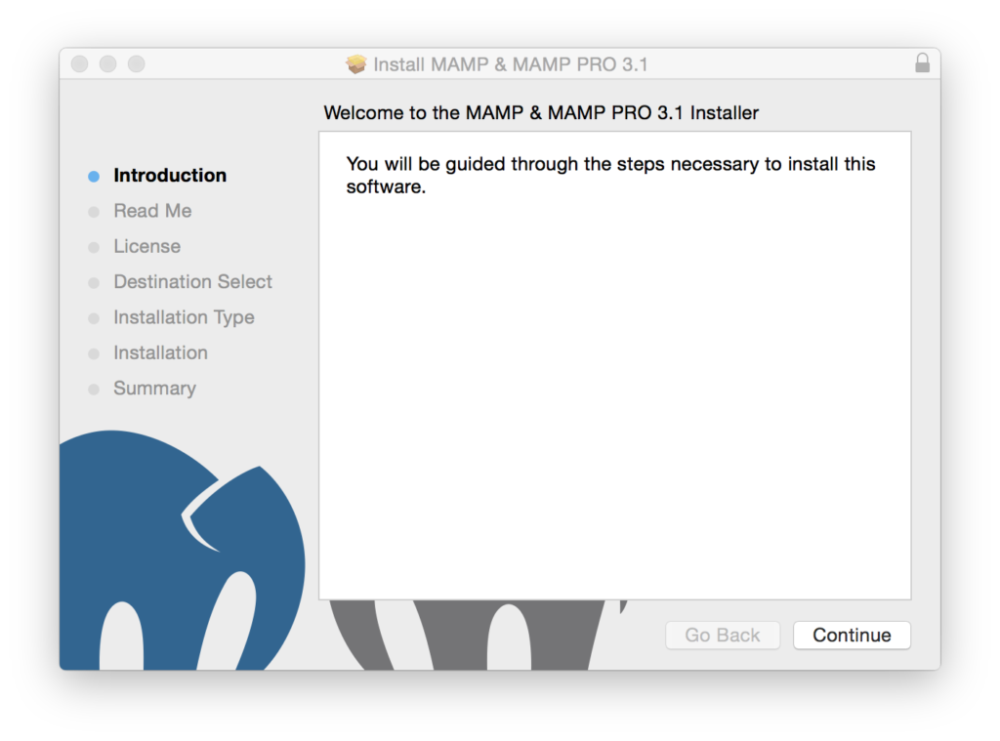
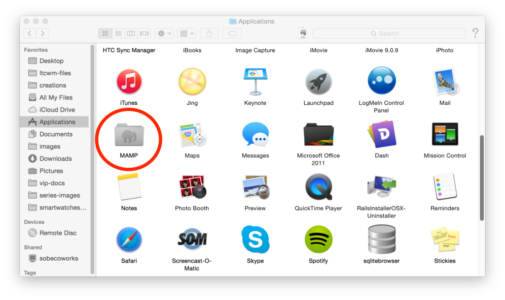
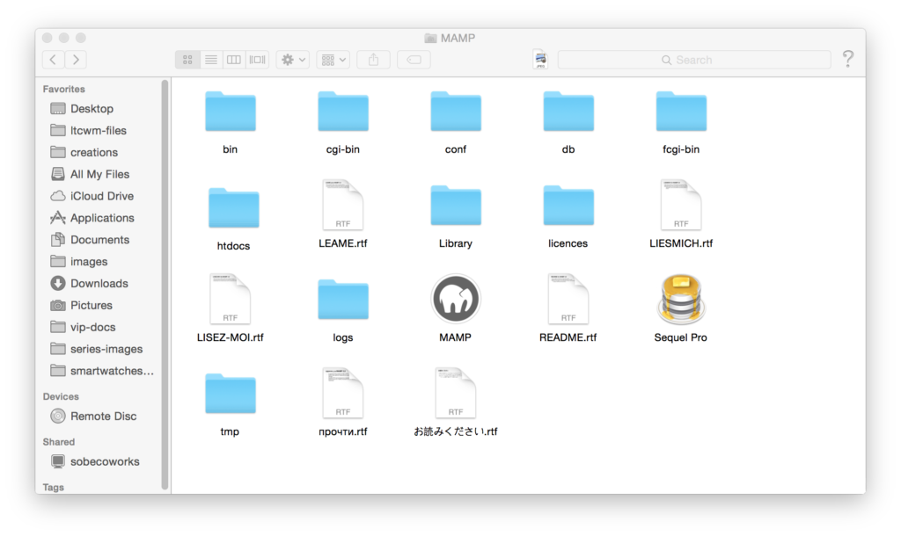
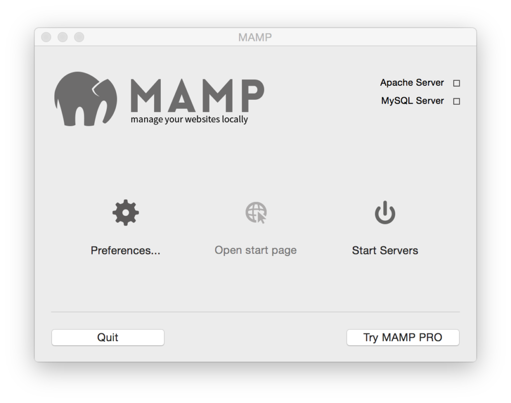
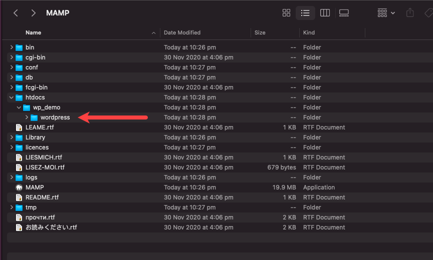

+++
title = "Local on Mac"
weight = 1
chapter = true
+++

# Local on Mac

## Installing MAMP

{}
Make sure you don't close this tab as you will want to refer back to the instructions along the way to make sure you select the right options during installation. It might be a good idea to bookmark this page in case you accidentally lose it!
{}

Head to the [official MAMP website](https://www.mamp.info/en/downloads/) and click the download link with the apple icon. The download should start automatically. When it's finished, click on the downloaded file and a typical installation screen will appear. Continue with the installation steps until you get to Installation Type and then follow the screenshots below.

**Don't upgrade to the pro version**, you don't need it. Check out the screenshots below for step by step instructions.

Once you have completed the installation, you may need to launch MAMP. If the program is not already open, go to your Applications folder (where it should have been saved) and click the MAMP folder. Once inside, you should see folder contents similar to the below. Click on the Elephant icon, and the MAMP application should open.

## Start Your Engines

Ok, servers. But engines sounds way cooler...

In MAMP, click on the **Open start page** option. If you can't click it, hit **Start Servers** first.

Clicking the Open start page button should open the Welcome page for MAMP in a browser. That means everything is shiny! You can close that page now if it is working fine and move on to the next step. If something else unexpected happened, you might want to double check that you have completed all the requisite steps and/or ask a mentor for assistance.

## Downloading WordPress

Next you will need to [download the latest version of WordPress](https://wordpress.org/download/#download-install) as a zip file. We'll need this file in just a moment so make sure you remember where you saved it!

1. Create a folder under Applications > MAMP > htdocs called 'wp_demo'
2. Double click to unpack the zip file if you're not using Safari, and then copy the folder called "wordpress" into the following folder:
Applications > MAMP > htdocs > wp_demo
3. Your wordpress folder should now show like this in Finder.

## Creating Your Database

Woohoo, you're doing great! Before we can install WordPress, we need a database.

A database is a structured set of data that is accessible in a bunch of different ways. We are going to set up a database using open source (that means free) technology called MySQL. It is used by most web applications, including Facebook, Twitter, YouTube, Yahoo... all the cool kids! 

{}
An easy way for most people to get their head around how a database works is to think of Microsoft Excel. Most spreadsheets have rows of data, with columns corresponding to different attributes. Now imagine your data is so complex that you need more than one spreadsheet... Then you want those spreadsheets to talk to each other, and you want to be able to do calculations using data from more than one of those spreadsheets. That's similar to how a database works! It's all about storing the data efficiently so you can link it together.
{}

Now that we've covered the general idea of a database, let's go ahead and set one up. 

1. Visit the URL [http://localhost:8888/phpMyAdmin](http://localhost:8888/phpMyAdmin) in your web browser.
2. Click on the Databases tab in the top left. 
3. Create a new database called "wp_demo."

{}
You can actually call your database whatever you like, but it's a great idea to name it so that you will know what site it correlates with!
{}

## Completing the WordPress Install

Go to the following URL in your browser:

[localhost:8888/wp_demo/wordpress](http://localhost:8888/wp_demo/wordpress)

You should now see the translation screen that precedes the extremely famous 5-minute WordPress installation. Choose your language (please be nice to your mentors and choose English!) and continue to the next screen.

On the first screen (where it asks for database details) you will need to use the exact same details as in the screenshot below. If you have used a database name that is different from wp_demo, use that instead for the first field.

On the next screen you can choose your own username and password, just make sure you save it somewhere!

Now you're ready to start using WordPress!
