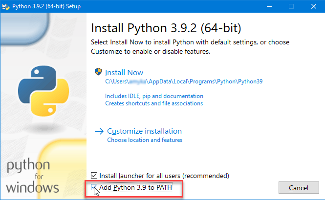

+++
title = "Python installation"
date = 2021-02-04T20:02:00+08:00
weight = 10
chapter = true
pre = "<b>1. </b>"
+++

# Let’s start with Python

We're finally here!

We need Python before we can start.
 Let's start by installing Python! We want you to install Python 3.11, however if you already have an earlier version installed that should work too!
 

{}
It is generally best to use the latest version of Python - this includes the latest features, bug fixes, security updates and performance improvements.
{}


{}  
This section is based on [a tutorial by Geek Girls Carrots](https://github.com/ggcarrots/django-carrots).
{}


## Install on Windows

First check whether your computer is running a 32-bit version or a 64-bit version of Windows, by pressing the Windows key + Pause/Break key which will open your System info, and look at the "System type" line. You can download Python for Windows from the website https://www.python.org/downloads/windows/. Click on the "Latest Python 3 Release - Python x.x.x" link. If your computer is running a **64-bit** version of Windows, download the **Windows x86-64 executable installer**. Otherwise, download the **Windows x86 executable installer**. After downloading the installer, you should run it (double-click on it) and follow the instructions there.

One thing to watch out for: During the installation you will notice a window marked "Setup". Make sure you tick the "Add Python 3.x to PATH" checkbox and click on "Install Now", as shown here:



In upcoming steps, you'll be using the Windows Command Line (which we'll also tell you about). For now, if you need to type in some commands, go to Start menu → All Programs → Accessories → Command Prompt. You can also hold in the Windows key and press the "R"-key until the "Run" window pops up. To open the Command Line, type "cmd" and press enter in the "Run" window. (On newer versions of Windows, you might have to search for "Command Prompt" since it's sometimes hidden.)


{}
If you are using an older version of Windows (7, Vista, or any older version) and the Python installer fails with an error, you can try either:  
Install all Windows Updates and try to install Python again  
**Or**  
Install an [older version of Python](https://www.python.org/downloads/windows/), e.g., [3.4.4](https://www.python.org/downloads/release/python-344/).
{}

If you install an older version of Python, the installation screen may look a bit different than shown above. Make sure you scroll down to see "Add python.exe to Path", then click the button on the left and pick "Will be installed on local hard drive":


## Install on Mac

{}
Before you install Python on OS X, you should ensure your Mac settings allow
 installing packages that aren't from the App Store.  
 Go to System Preferences (it's in the Applications folder), click
 "Security & Privacy," and then the "General" tab.  
 If your "Allow apps downloaded from:" is set to "Mac App Store," change it
 to "Mac App Store and identified developers."
{}

You need to go to the website https://www.python.org/downloads/ and download the latest version of the Python installer:

* Download the *Mac OS X 64-bit/32-bit installer* file,
* Double click *python-3.x.x-macosx10.x.pkg* to run the installer.

## Install on Linux

It is very likely that you already have Python installed out of the box. To check if you have it installed (and which version it is), open a console and type the following command:

<!-- command-line -->
```
$ python3 --version
Python 3.7.3
```

If you have a different 'micro version' of Python installed, e.g. 3.7.0, then you don't have to upgrade. If you don't have Python installed, or if you want a different version, you can install it as follows:

## Install for Debian and Ubuntu

Type this command into your console:

<!-- command-line  -->
```
$ sudo apt-get install python3
```

## Fedora (up to 21)

Use this command in your console:

<!-- command-line<!--  -->
```
$ sudo yum install python3
```

## Fedora (22+)

Use this command in your console:

<!-- command-line<!--  -->
```
$ sudo dnf install python3
```

## openSUSE

Use this command in your console:

<!-- command-line<!--  -->
```
$ sudo zypper install python3
```

Verify the installation was successful by opening the *Terminal* application and running the `python3` command:

<!-- command-line<!--  -->
```
$ python3 --version
Python 3.7.3
```

{}
If you're on Windows and you get an error message that `python3` wasn't found, try using `python` (without the `3`) and check if it still might be a version of Python 3.
{}

----

If you have any doubts, or if something went wrong and you have no idea what to do next, please ask a mentor!
