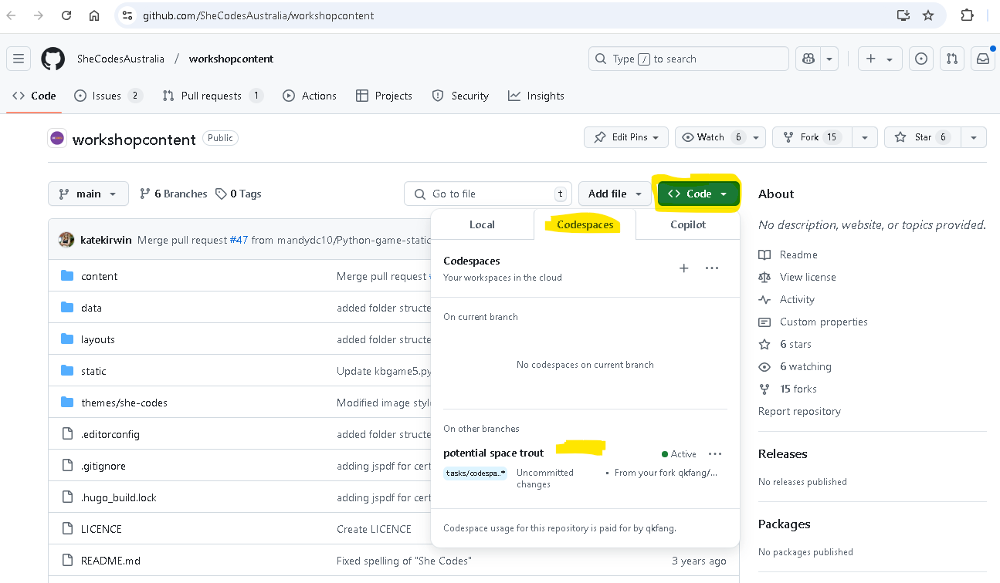

+++
title = "Code Editor"
date = 2021-02-04T20:02:00+08:00
weight = 20
chapter = true
pre = "<b>2. </b>"
+++
# Code editor

You're about to write your first line of code, so it's time to download a code editor!

{}
You might have done this earlier in the Installation chapter – if so, you can skip right ahead to the next chapter!
{}

There are a lot of different editors and it largely boils down to personal preference.

Our suggestion is below, but feel free to ask your mentor about other code editors.

## VS Code (Local)

VS Code is a very popular and free to use editor. It's available for Windows, OS X and Linux. Note, if you are using a Chromebook then it will present you with a few options to download from, choose the option that has the `.deb` or `debian` and that should work for you.

[Download it here](https://code.visualstudio.com/)

## VS Code (Remote with GitHub Codespaces)

You can also use VS Code in the browser directly without any installation locally.

Go https://github.com/SheCodesAustralia/workshopcontent, and hover `Code` button, in the dropdown, select `Codespaces` tab, then click the green `Create Codespaces` button. 

After a while, the online VS Code will open in your browser and you can write code in the browser directly!.

## Why are we installing a code editor?

You might be wondering why we are installing this special code editor software, rather than using something like Word or Notepad.

The first reason is that code needs to be **plain text**, and the problem with programs like Word and Textedit is that they don't actually produce plain text, they produce rich text \(with fonts and formatting\), using custom formats like [RTF \(Rich Text Format\)](https://en.wikipedia.org/wiki/Rich_Text_Format).

The second reason is that code editors are specialized for editing code, so they can provide helpful features like highlighting code with colour according to its meaning, or automatically closing quotes for you.
