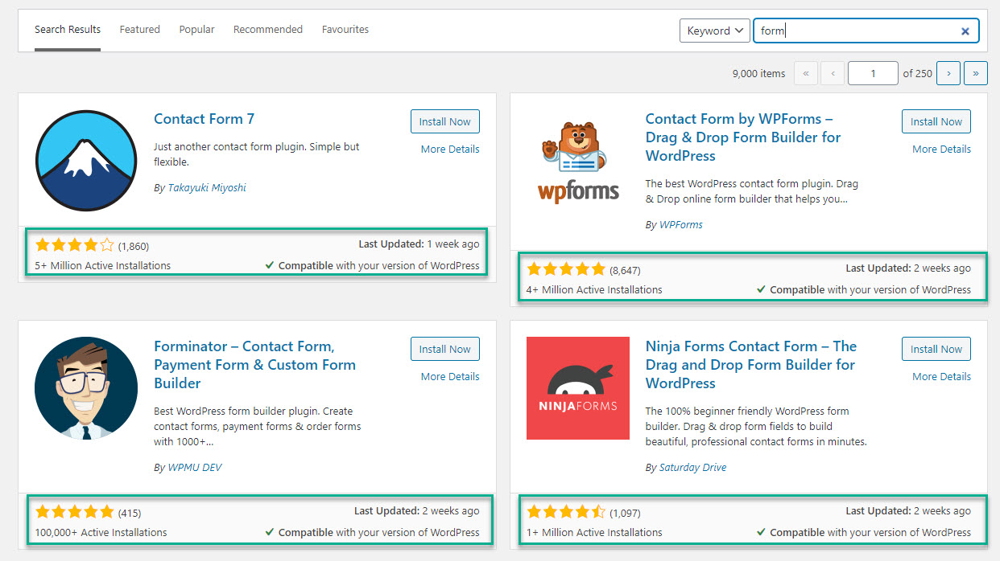

+++
title = "There's a plugin for that"
weight = 1
chapter = true
+++

# Extending WordPress with Plugins

We covered the basics of Plugins before and how they fit into the WordPress eco-system, and now we're going to install some of our own!

{}
NOT ALL PLUGINS ARE CREATED EQUAL.
Before you install a plugin on your website, make sure you follow the steps below to ensure it is not going to do you more harm than good. Remember that installing a plugin is the equivalent of adding code to your website from somebody you don't know. Do your research first and if in doubt, ask!
{}

To view the plugins we currently have installed, click on Plugins on the left hand menu. You will likely see two plugins already installed - Hello Dolly & Akismet Anti-Spam.

## Hello Dolly!

You can delete Hello Dolly. It is included with the standard WordPress package mainly out of tradition and was one of the very first WordPress plugins ever to be created.

## Akismet Anti-Spam

If you intend to allow people to leave comments (or reviews) on your website, we recommend keeping Akismet installed and activating it when you have time to register an account. While it is definitely not the only way to stop spam, it is a great option for those who are likely to get a lot of it.

{}
If you plan on turning the ability to leave comments off (recommended) you do not need Akismet installed and you can delete it.
{}

## Installing Plugins

To add new plugins, click the 'Add New' button at the top of the page. This will take you to the WordPress plugin repository, built right into your dashboard. Every plugin in the repository is free (although many have a paid premium version) but it's best not to install plugins that you don't need on your website. Today we are going to install a few critical ones to get us started and help you learn how to identify what makes a 'better' or 'worse' plugin.

The first plugin we are going to install is one that will allow us to add forms to our website. While there are dozens (maybe hundreds) of form builders available, you will notice very quickly if you search for 'form' that a few of them are significantly more popular than the others!

When choosing a plugin, we should pay particular attention to the three key pieces of information at the bottom of each plugin box:
- Average rating (out of five stars)
- Total number of active installations
- Date Last Updated & Compatibility with current version

### Star Rating & Number of Installs

When assessing the rating of a plugin, it is important to look at *both* the number of installations and the star rating. Take this example:
1. A plugin has a rating of 4.5 stars and 10,000 active installations
2. A different plugin has a rating of 4.4 stars and 5 million active installations

If we convert the stars to a percentage, 4.5 out of 5 = 90% and 4.4 out of 5 = 88%. 90% of 10,000 = about 9000 happy users, whereas 88% of 5 million equals about 4.4 million. That's a LOT more social proof on plugin number 2!

### Last Updated & Compatibility

Everything in the WordPress eco-system from WordPress core to themes and plugins is regularly updated for a variety of reasons, including security, bug fixes and improvements or feature additions. It is important to choose plugins that are regularly updating and testing to maintain compatibility which is why this information is so easily located. Generally speaking, the more users a plugin has the more often it will be updated. 

### Contact Forms

For the purposes of today's tutorial, we are going to install either Contact Form 7 or WPForms. If you would like to have full flexibility and aren't afraid of a little code, choose Contact Form 7. If you prefer more of a 'drag and drop' style interface, choose WPForms. If you change your mind you can always delete one and install the other but we recommend not having both activated at the same time.

To install your plugin, click the `Install Now` button then once it has finished installing click the blue `Activate` button. This will take you back to the list of installed plugins.

If you have chosen WPForms you will be guided through the process of setting up a contact form. If you chose Contact Form 7 you will need to click the `Settings` link under the plugin name, or choose 'Contact' from the menu on the left. Contact Form 7 will already have a simple form set up, but if you are using WP Forms go ahead and set up a simple contact form. Don't worry too much right now about the fields - this is easy to configure later but right now we are going to learn how to display our form on our website.

Once you have created your first form, navigate in the dashboard to your Pages. Click on the page titled 'Contact' (or create one if you didn't earlier). Here you can add any contact details you would like to display on your website (if applicable). Under that, we can add our form super easily by simply typing a / and the word `form`. You should now see a new block showing called either Contact Form 7 or WPForms. Choose the block and update your page, then view it to see your new form!

### Pods

We now have almost all of the tools in our arsenal to start building the website of our dreams - but we are going to learn one final thing before you go wild designing and creating your masterpiece. To do this, we are going to install one more plugin - this time called Pods. 

Navigate to Plugins > Add New and search for `Pods` then choose the plugin titled **Pods - Custom Content Types & Fields**.

Install & Activate the plugin - you should now see a new tab on the left called 'Pods Admin.'

## The Plugin Rabbithole

In the interest of saving time we won't be installing many more plugins today, but here is a list of ones recommended by our mentors you might want to consider checking out in your own time...

### UpdraftPlus WordPress Backup Plugins
This will allow you to take an 'on demand' backup of your site and restore it if you break things!

### Disable Comments - Remove Comments & Protect from Spam
Unless you are creating a monetised blog or forum, there isn't much need to have comments enabled. This plugin turns them off sitewide and removes all references to comments from your dashboard.

### Health Check & Troubleshooting
This neat little plugin is maintained by the WordPress community, and provides you with the ability to disable themes & plugins while logged in without changing what visitors to your site see. It's great for debugging possible theme or plugin conflicts, and has lots of tips for keeping your website running smoothly.

### WordFence
Security on WordPress is super important - it is a very good idea to install a security plugin. WordFence is a good free option.

### Yoast or SEOPress
Often website owners want to be found by search engines, and there are lots of things we can do to make that more likely. Both of these plugins can help you improve your SEO if implemented correctly. Yoast has been around for a really long time and as such it has a lot of installs. It does add a lot of extra stuff to the dashboard that isn't really required though - so if you prefer something a little leaner SEOPress is a great alternative.

### Yoast Duplicate Post
An extremely simple plugin it only does one thing - allows you to duplicate an existing page, post or custom post type!

### WooCommerce
This one is a lot more complex, but if you would like to sell products online WooCommerce is totally free (although there are lots of paid options if you want the bells and whistles).

### Code Snippets
If you'd like to dabble in adding your own code to your website (more than just styling - think PHP or JavaScript) the Code Snippets plugin allows you to create a library of code that you can tag, sort, categorise and activate/deactivate independently. If you are learning to code in WordPress you should definitely install this!

### Elementor
If you've decided that design is more your thing than development the Elementor plugin allows you to use a drag and drop builder to create beautiful layouts with ease. The free version is fun to play with, and the pro version allows you to virtually create your own theme without the use of any code.

Before you start thinking "I wonder if there's a plugin for this?" Let's explore what we can do with the one we've just installed!