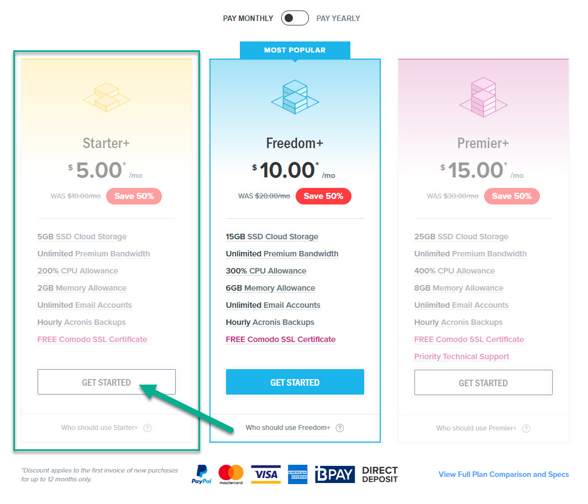
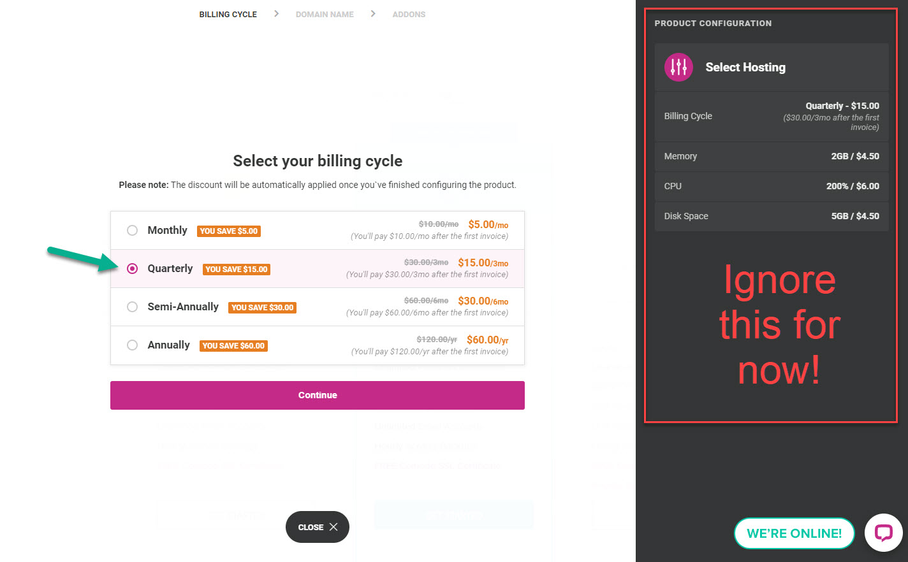
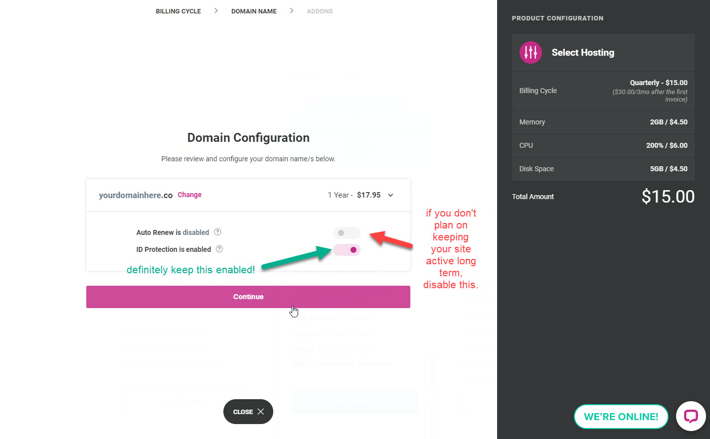
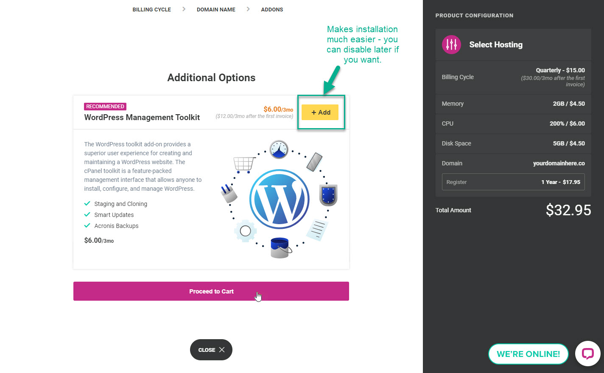
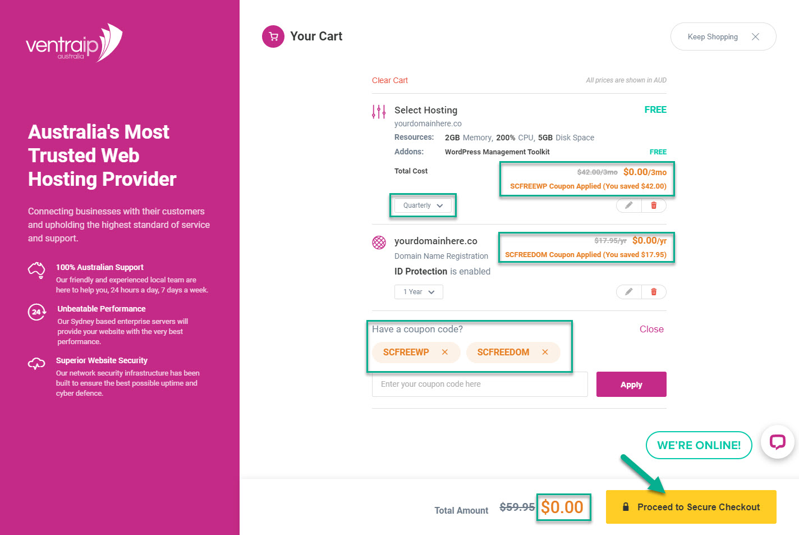
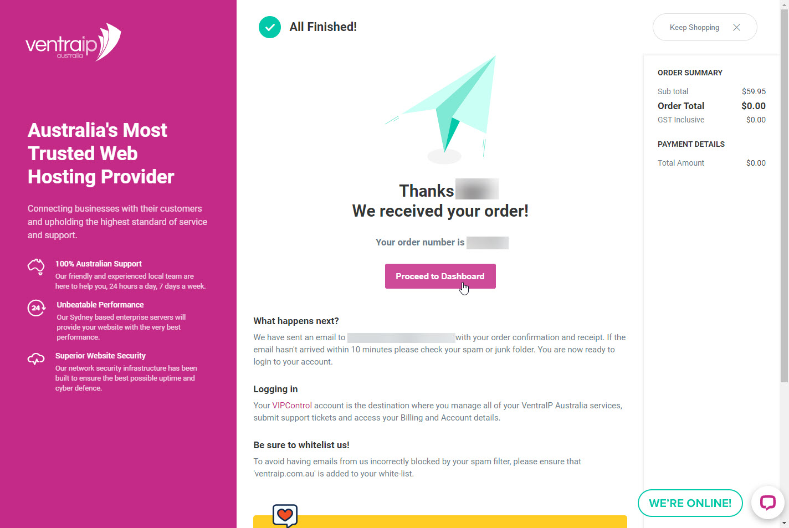

+++
title = "Domains & Hosting"
weight = 2
chapter = true
+++

Now that we (hopefully) are a little clearer on what hosting and domain names are all about, it's time to register your own! As mentioned on the previous page, VentraIP have partnered with the She Codes organisation and offer our attendees 3 months free hosting along with 12 months free domain registration for ".co" domains.

In order to take advantage of this offer, you will need to make sure you follow the instructions in the following steps and add the coupon codes right at the end as per the screenshots. We've provided screenshots of every step of the process, so you don't have to guess what to tick (or not)!

The first step is to click this link. Once you land on the page, choose the first (Starter) package as per the screenshot below.

{}
Make sure you don't close this tab as you will want to refer back to the instructions along the way to make sure you select the right options. It might be a good idea to bookmark this page in case you accidentally lose it!
{}

[VentraIP hosting & domains](https://ventraip.com.au/web-hosting/business-hosting/)

Now you will be guided through some options. This process should be pretty quick - just follow the instructions below in the screenshots. On the first screen, make sure that you choose 'quarterly' instead of 'monthly' or you won't get your full 3 months free! If you forget, you should be able to change this right before you checkout at the end.

Next we get to choose a domain! 

{}
In order to get your free domain, you will need to make sure it ends in `.co` and not any other extension (such as `.com` or `.com.au`.
{}

On the next screen you can choose whether to keep this domain after a year. If you don't plan on keeping the domain long-term, you can disable auto-renew.

{}
Always take advantage of the free ID Protection - it's a great way to minimise how much spam you receive from those trying to sell you stuff!
{}

In this step we have the option of adding on the WordPress Management Toolkit. Usually this is a little extra, but for She Codes students it's also free for 3 months! After that you can either keep it, or choose to cancel the kit (even if you keep your hosting & domain active). It packs a bunch of cool tools that will make installing WordPress a breeze, so make sure you add it on in this step.

We're nearly done! All we have left to do is take advantage of the sweet, sweet deal we've prepared for you by adding the two coupon codes `SCFREEWP` and `SCFREEDOM`. Before we proceed to check out, make sure you also check that your selection matches the screenshot - especially:
- Quarterly is selected under Hosting
- Both coupon codes have applied successfully
- Total amount due is $0.00 (yay!)

Now we can proceed to checkout - you will need to create an account with VentraIP, add your personal details and hit 'Complete Order.' Once finished, you should see a page that looks like this:

Congratulations, you now have a domain name and a way to host a website on it!

{}
When a new user registers a domain name it is common to be asked to verify it within a certain period of time (usually thirty days) by clicking a link you receive via email. If you notice any emails **from VentraIP** asking you to click a link to verify your domain in the next few weeks you should do so, otherwise you may risk your domain becoming suspended or revoked.
{}

Now we can move on to the final setup step - installing WordPress!