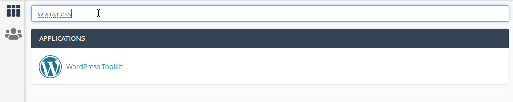
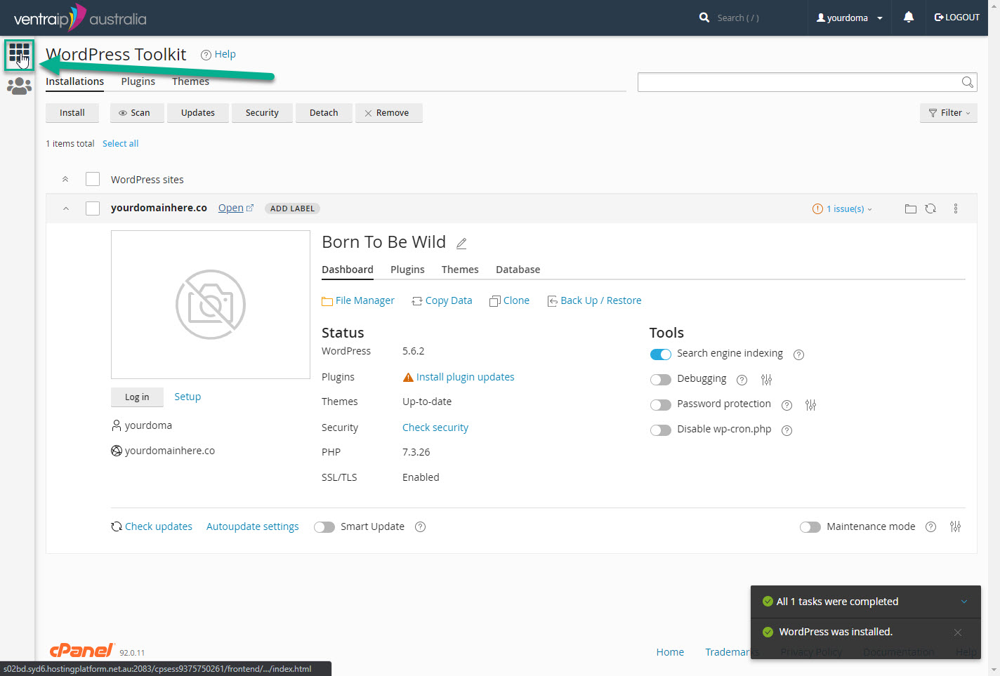
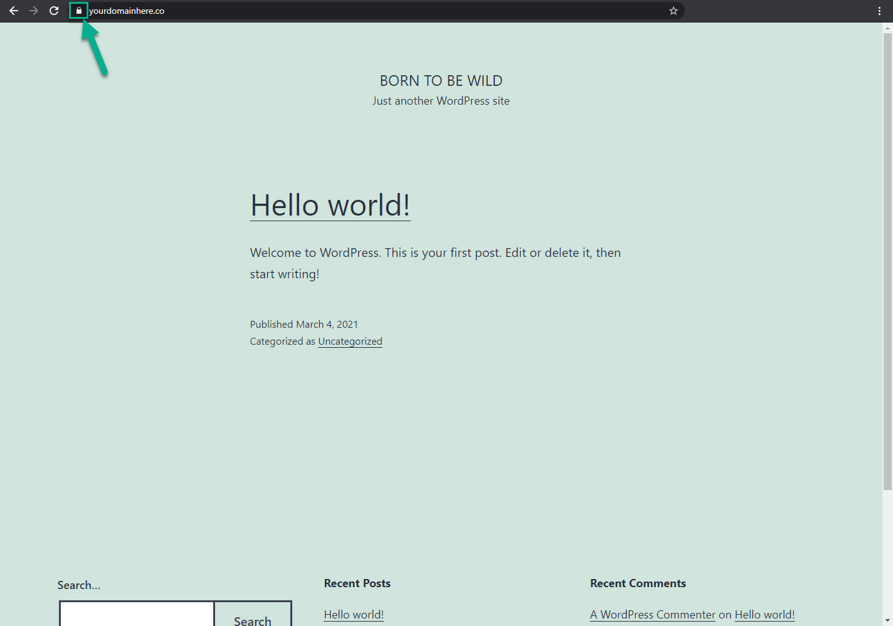

+++
title = "Installing WordPress"
weight = 3
chapter = true
+++

# Installing WordPress

Now that we've got a domain and a hosting account, let's put something on it!

If you are still on the confirmation page, go ahead and click the **Proceed to Dashboard** button. You may be prompted to confirm your details before you are logged in.

Once you are in the dashboard, scroll down until you find the **cPanel Hosting** tab. Select it, then click the orange **cPanel** button.

The screen you now see is how we can install software on our server. Our server is like a really big, specialised computer - and cPanel is kind of like the operating system that allows us to interact with it. There are dozens of options in CPanel, but luckily we only need to deal with one or two today!

To get started, search for 'wordpress' in the search bar at the top of the page. Select the WordPress Toolkit under Applications.

Use the screenshot below as a guide to complete the installation. The main things of importance here are:
- Make sure that you have 'https' selected at the start of your domain and that the installation path field is empty
- Set the plugin/theme to 'none'
- Change the language to English (Australia)
- Don't use 'admin' as your username ([read why here!](https://www.wpsuperstars.net/change-admin-username/))
- **save your password**
- **make sure you change the email to one you have access to.*

{}
Under 'Automatic Update Settings' at the bottom of the page you will be given a range of options to choose from for running automatic updates. Generally speaking it is best to keep your site updated, but running automatic updates on a website can be risky. We recommend choosing the option for security updates only, and manually updating on a regular schedule. While you are welcome to update everything automatically, please be aware that it may sometimes result in unexpected problems with how things work or display.
{}

Once you hit install, you will see a progress bar that shows the progress of the installation. Once completed, you will see an overview page of your new WordPress site. If any prompts about plugins pop up just ignore/cancel for now - we'll cover those in a bit.

It may be tempting to click `Open` straight away once the install is complete(you might have even already done it) but chances are that if you do, you will get a security warning or a screen that looks like this:

Don't freak out! This is an easy fix - we just need to install something called an **SSL Certificate**.

# Installing an SSL Certificate

Have you ever been to a website and received a warning in your browser saying "this is not secure"? I'll bet the first thing you did was hit the back button, and we certainly don't want that to happen when people visit your new website!

To make sure our website stays secure, it's really important that we install something called an 'SSL Certificate.' This is a certificate of authenticity that tells the internet that you are who you say you are, and stops potential malicious users from impersonating your website. It also encrypts the data that transfers between your website and the users who are viewing it - so things like credit card details are kept secure!

All good hosting companies should include automatic SSL certificates at no extra cost, but sometimes you will need to manually speed up the process of generating the first one. We're going to run through that process now.

From the overview screen you are on, click the grid icon in the top left to return to the main screen.

Now use the search bar at the top of the page but this time use the search term 'SSL.' You should see two options - choose the one labelled `SSL/TLS Status`.

 
 
 If your screen looks like this, with green padlocks - awesome! You don't need to do anything. However if (more likely) you have red padlocks, you'll need to hit that 'Run AutoSSL' button. It can take a few minutes, but the screen should automatically update once your certificate is successfully generated.
 
 
 
 Now we can visit our new website - just type in the URL into your web browser!
 
 