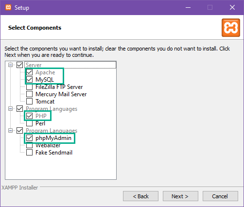
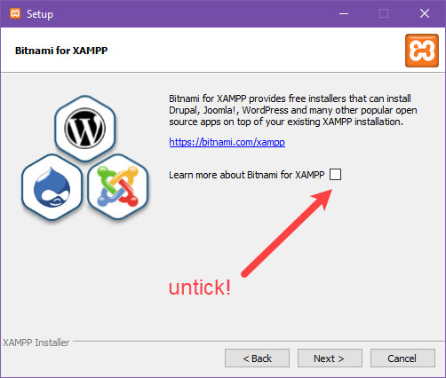
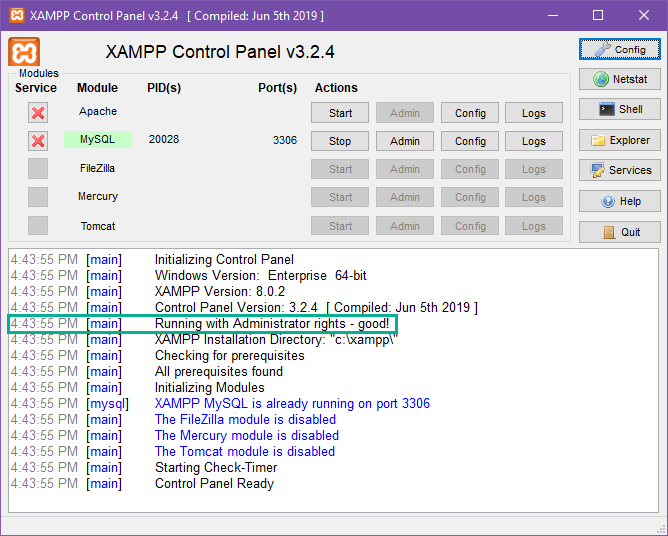
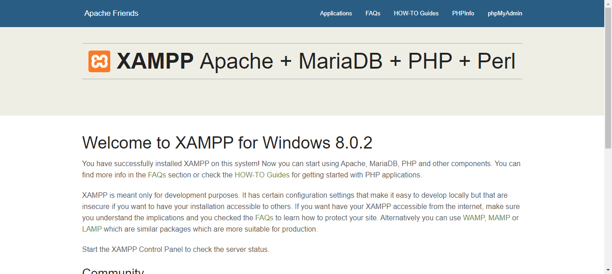

+++
title = "Local on PC"
weight = 2
chapter = true
+++

# Local on PC

## Installing XAMPP

{}
Make sure you don't close this tab as you will want to refer back to the instructions along the way to make sure you select the right options during installation. It might be a good idea to bookmark this page in case you accidentally lose it!
{}

Go to the [Apache Friends website](https://www.apachefriends.org/index.html) and download XAMPP.

Once downloaded, launch the installer. If you get a warning about UAC permissions, don't worry too much - we'll show you how to work around this in a later step.

Now the XAMPP setup wizard will guide you through the installation.

{}
**DO:**
- Click “Yes” to continue with the install if you get security warnings.
- Speak to a mentor if you're unsure
- Untick the "Learn More About Bitnami" checkbox
- Tick MySQL, phpMyAdmin, Apache & PHP on the "Components" page
- Read the Don'ts first!!
- Save & Close all unnecessary programs & files before starting (your computer may need to reboot)
{}

{}
**DON'T:**
- Install Bitnami (you don't need it, I promise)
- Select components you don't need - those listed above are all that is required!
{}

Install the XAMPP folder to C:\XAMPP (it should install here by default).

{}
If you get the below security/firewall warning while installing or using XAMPP (see example below), make sure you check “Private networks, such as my home or work network” and click “Allow access.” If you don’t, XAMPP won’t work!
{}

{}
You may find that in the next step your computer will try to restart. It's best to save and close any open programs or documents now, just in case! It's also a good idea to bookmark this page if you haven't already.
{}

You can now go ahead and start the control panel (tick the box and click "Finish"). If you accidentally click Finish without ticking the box, you can still get to the Control Panel by navigating to the XAMPP folder on your computer.

If your computer restarted and XAMPP doesn't automatically start, you can start it manually from the start menu:

When you start XAMPP, you may notice a warning about administrator rights.

You can fix this easily by closing the program and re-opening with administrator rights by right clicking on the icon in the start menu.

{}
If you can't find XAMPP in the start menu, your installation may not have completed correctly. We recommend running through the installation again to be certain.
{}

If you see red warnings, you might have some errors you need to sort out first. Continue with the section below about fixing port errors. If everything is black and blue, you can skip through to the section below that titled **Running XAMPP.**

## Fixing Port Errors

Take a deep breath - we're about to get a bit technical. Just follow the instructions and don't be afraid to reach out to a mentor if you get stuck!

If you’re using Windows 10, *World Wide Web Publishing Service* is most likely using post 80. This program, which is for Internet Information Services (IIS) for Windows® Server, comes pre-installed and if you’re not using it, you can simply stop the service running on your machine or even delete it.

To stop the service running, do the following:

1. Go to **Start**, type in “services.msc” and select the best match
2. Scroll down in the Services window to find **World Wide Web Publishing Service**
3. Right-click on it and select **Stop**
4. This should free up port 80. When you restart XAMPP it should run without errors

If that doesn’t resolve the issue, you can set up a new firewall rule to forcibly unblock the ports:

1. Open Windows Firewall on your machine and > click on **Advanced Settings** on the left
2. Click on **Inbound** on the left, then on the far right click **New Rule**
3. Click **Port** and then **TCP**. In the field below for **Specific Ports** type in “80, 443” and click **Next**
4. Check **Allow the Connection** then click **Next**
5. Make sure all options are checked and click **Next**
6. In the name field, enter whatever you want, but for the sake of consistency let’s type in **LOCALHOST1**. Click **Finish**
7. Now repeat steps 1-6, but name this new rule LOCALHOST2 and click **Finish**
8. Restart your computer

Ports 80 and 443 should now be open locally on your computer.

## Running XAMPP

Once you are in the shiny black and blue only situation, you need to:

1. Start Apache
2. Start MySQL

If you accidentally left some of the components we don't need ticked (such as FileZilla, Mercury or Tomcat) you may also have Start buttons for these available. Don't turn them on, as we don't need them for anything.

Test that everything works fine by visiting this link in your browser: [http://localhost](http://localhost/)

If everything is set up correctly, you should see a "Welcome to XAMPP" screen.

If not, well... take a deep breath and call a mentor!

## Setting Up Your Database

Woohoo, you're doing great! Before we can install WordPress, we need a database.

A database is a structured set of data that is accessible in a bunch of different ways. We are going to set up a database using open source (that means free) technology called MySQL. It is used by most web applications, including Facebook, Twitter, YouTube, Yahoo... all the cool kids! 

{}
An easy way for most people to get their head around how a database works is to think of Microsoft Excel. Most spreadsheets have rows of data, with columns corresponding to different attributes. Now imagine your data is so complex that you need more than one spreadsheet... Then you want those spreadsheets to talk to each other, and you want to be able to do calculations using data from more than one of those spreadsheets. That's similar to how a database works! It's all about storing the data efficiently so you can link it together.
{}

Now that we've covered the general idea of a database, let's go ahead and set one up. 

1. In XAMPP, click on the 'Admin' button next to MySQL.
2. Click on the Databases tab in the top left. 
3. Create a new database called "wp_demo."

{}
You can actually call your database whatever you like, but it's a great idea to name it so that you will know what site it correlates with!
{}

You may see a warning that there are no tables in the database. This is normal, as we haven't added any yet! We'll do that in the next step.

## Installing WordPress

We now need to [download the latest version of WordPress](https://wordpress.org/download/#download-install) as a zip file. Click the blue Download button and make sure you know where the file downloads to. 

Once downloaded, go to the XAMPP folder on your computer.

{}
If you followed the instructions in Step 1 this will be C:\XAMPP
{}

Open the folder called htdocs. Create a new folder **inside the htdocs folder** called "wp_demo" to match your database. Unzip the WordPress package into that folder.

Now we can install WordPress! Open your browser and go to [http://localhost/wp_demo/wordpress](http://localhost/wp_demo/wordpress)

You should now see the translation screen that precedes the extremely famous 5-minute WordPress installation. Choose your language (please be nice to your mentors and choose English!) and continue to the next screen... and then the one after that!

On the first screen (where it asks for database details) you will need to use the exact same details as in the screenshot below. If you have used a database name that is different from wp_demo, use that instead for the first field.

On the next screen you can choose your own username and password, just make sure you save it somewhere!

Now you're ready to start using WordPress!
